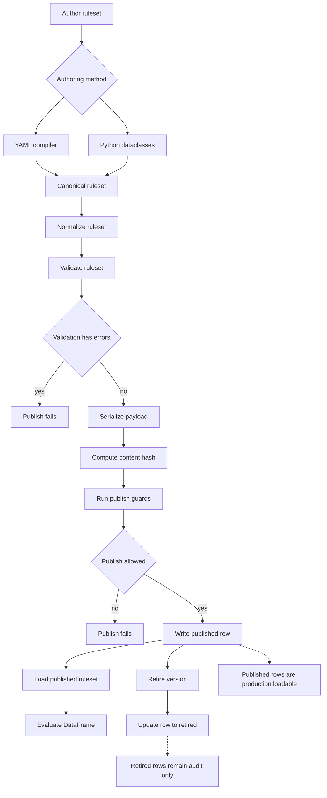
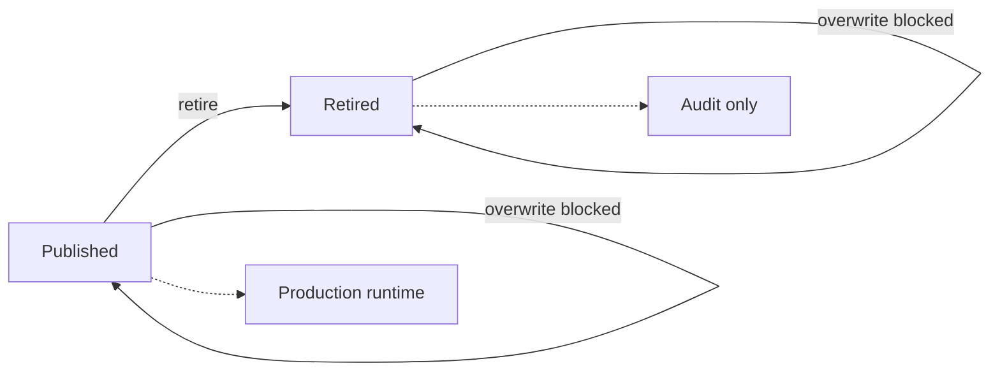
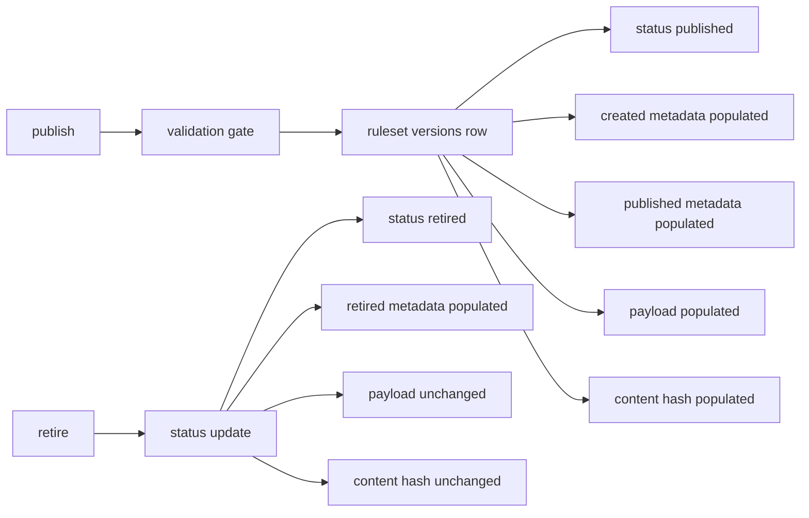

# Rules Engine

`rules_engine` is a strict, metadata-first Python rules engine designed for
Databricks workflows that require deterministic behavior, explicit metadata,
and audit-ready persistence.

The package compiles canonical YAML or code-authored dataclasses into immutable
ruleset models, validates them, normalizes them into publish-ready metadata,
persists them to Spark/Delta tables, and evaluates them against Spark
DataFrames.

The design intentionally avoids aliases, expression DSLs, raw persisted
lambdas, hidden runtime defaults, hidden cross-row behavior, and silent
semantic weakening.

## Contents

- [Who This Is For](#who-this-is-for)
- [Core Concepts](#core-concepts)
- [Package Layout](#package-layout)
- [Method Reference And Side Effects](#method-reference-and-side-effects)
- [Semantic Contract](#semantic-contract)
- [Authoring YAML](#authoring-yaml)
- [Compile, Validate, Normalize](#compile-validate-normalize)
- [YAML Export And Round Trip](#yaml-export-and-round-trip)
- [Custom Function Registry](#custom-function-registry)
- [Spark Runtime](#spark-runtime)
- [Spark Compatibility Validation](#spark-compatibility-validation)
- [Rules Engine Service](#rules-engine-service)
- [Spark/Delta Repository](#sparkdelta-repository)
- [Publish Lifecycle](#publish-lifecycle)
- [Standard Workflows](#standard-workflows)
- [Auditability Model](#auditability-model)
- [Databricks System Test](#databricks-system-test)
- [Testing](#testing)
- [Packaging](#packaging)
- [Developer Workflow](#developer-workflow)
- [Troubleshooting](#troubleshooting)
- [Known Limitations](#known-limitations)

## Who This Is For

This package is intended for engineers building governed rule execution
workflows where rules must be:

- authored in a readable external format,
- validated before execution,
- persisted as queryable metadata,
- executed deterministically,
- auditable after the fact,
- promoted through controlled lifecycle states.

The primary and supported runtime is Databricks Spark.

## Core Concepts

### Ruleset

A `Ruleset` is the top-level metadata object. It has:

- `ruleset_id`
- `ruleset_name`
- `version`
- `owner`
- `owner_department`
- optional `description`
- ordered `rules`
- optional executable `expect` cases

Persisted lifecycle statuses are exactly:

```text
published
retired
```

Authored YAML does not need a lifecycle status. The compiler defaults authored
rulesets to `published`; the repository stores and updates lifecycle status.

### Rule

A `Rule` contains:

- `rule_id`
- `rule_name`
- `rule_order`
- `root_group`
- `assignments`
- `active_flag`
- `stop_on_match`
- optional `description`

Rules are evaluated in `rule_order`. If a rule matches and `stop_on_match` is
`true`, later rules are not evaluated for that row.

### Condition Group

A condition group is a logical tree node with exactly one logical operator:

```text
all
any
```

Groups may contain conditions and nested groups. Empty groups are invalid.

### Condition

A condition compares a left operand to an optional right operand using a
canonical operator. `error_on_null` controls whether a remaining null operand
fails the condition or raises a row error. Numeric tolerance is explicit.

### Operand

Operands are one of:

```text
field
assigned
literal
custom_function
```

No operand aliases are accepted. Any operand may declare `default_if_null` as a
non-null literal. The runtime substitutes that value before comparison or
assignment.

### Assignment

Assignments are emitted when a rule matches. Assignment values may be literals,
fields, prior assigned values, or custom functions. A rule may assign multiple
different target fields, but it may not assign the same target more than once.
Use separate ordered rules when the same target needs multiple candidate values.

`assignment_id` is audit identity only; it does not control execution order or
precedence. IDs must be unique within one `ruleset_id + version`. IDs may be
retained across versions for the same logical assignment and may be reused by a
different ruleset. When an ID is omitted, the compiler generates
`assignment:<rule_id>:<target_field>` for both mapping shorthand and list-form
assignments.

### Executable Expected Cases

Rulesets may carry small, named examples that execute without Spark and block
publication when their expected business result changes:

```yaml
expect:
  - name: prime loan classification
    given: {fico: 740}
    then:
      matched: true
      matched_rule_ids: [prime, near-prime]
      bucket: prime
```

Keys other than `matched`, `matched_rule_ids`, and `assign` are assignment-field
shorthand. An explicit `assign` mapping is also accepted and is checked as a
subset, so examples can assert only the fields relevant to the case. Run them
with `service.test_ruleset(ruleset)`; `service.publish(...)` runs the same suite
as a hard gate before any repository write.

Shorthand and explicit assignment keys must be target fields declared by the
ruleset, so a typo fails validation as `EXPECTED_CASE_UNKNOWN_KEY`. If a target
field is literally named `matched`, `matched_rule_ids`, or `assign`, assert it
inside the explicit `assign` mapping to avoid the reserved result names.

Expected cases evaluate raw Python values without a Spark schema. They verify
rule ordering, matching, custom-function behavior, and assignment selection,
but they do **not** apply Spark assignment coercion or prove that an incoming
DataFrame is schema-compatible. `evaluate_dataframe()` performs that separate
typed compatibility gate when the real DataFrame is available.

## Package Layout

```text
rules_engine/
  __init__.py
  analytics.py            # coverage and closest-rule diagnostics
  change_control.py       # human-readable semantic version diff
  compiler_yaml.py        # YAML -> dataclasses
  enums.py                # canonical vocabulary
  exceptions.py           # package exceptions
  exporter_yaml.py        # dataclasses -> canonical YAML
  models.py               # domain and persistence row dataclasses
  normalizer.py           # publish-ready explicit metadata
  publish.py              # lifecycle orchestration
  registry.py             # custom function registry
  repository.py           # Spark/Delta metadata repository
  runtime.py              # reference/test row evaluator used by Spark row UDF
  serializer.py           # dataclasses <-> persisted payload rows
  spark_runtime.py        # Spark DataFrame runtime
  spark_types.py          # shared exact Spark type helpers
  spark_validator.py      # Spark compatibility validator
  testing.py              # pure-Python executable expected cases
  validator.py            # semantic validator

notebooks/
  rules_engine_developer_guide.py
  rules_engine_quickstart.py
  python_ruleset_authoring_guide.py
  custom_function_authoring_guide.py
  rules_engine_serverless_performance.py
  rules_engine_system_tests.py
  rules_engine_uat_tests.py

rule_sets/
  account_key_cap_mkt.yaml
  account_key_mra.yaml

tools/
  spark_dataframe_parity.py

tests/
```

## Method Reference And Side Effects

This section maps the major package methods to what they do, what they touch,
and what they intentionally do not do. Use this as the operational reference
while reading the developer notebook.

### `YamlRulesetCompiler.compile_text(yaml_text)`

Purpose:

- Parse a YAML string into the canonical `Ruleset` dataclass model.
- Reject malformed YAML and unsupported enum values.
- Preserve canonical vocabulary only.
- Require one top-level ruleset mapping with only contract-defined keys.

Side effects:

- None. It does not write Delta metadata, validate semantic rules, or execute
  data.

Common failures:

- keys outside the declared ruleset, rule, condition, operand, assignment, or
  expected-case contract;
- values whose YAML scalar type does not match the contract;
- a null `default_if_null`; omit the option when no substitution is wanted;
- duplicate YAML mapping keys; duplicate keys are rejected throughout the
  document before a YAML loader can discard an earlier value.

### `YamlRulesetCompiler.compile_path(path)`

Purpose:

- Read YAML text from disk and delegate to `compile_text()`.

Side effects:

- Reads one local/workspace file.
- Does not persist metadata or evaluate data.

### `RulesetValidator.validate(ruleset)`

Purpose:

- Validate the runtime-neutral semantic contract.
- Return a `ValidationResult` containing stable check names and human-readable
  messages.

Checks include:

- required IDs and rule attributes,
- duplicate rule IDs and ruleset-version-wide assignment IDs,
- duplicate assignment target fields within one rule,
- empty condition groups,
- unary/binary operand compatibility,
- custom function registry contracts,
- collection literal shape,
- null default requirements.

Side effects:

- None. Validation does not mutate the ruleset and does not write metadata.

### `SparkRulesetCompatibilityValidator.validate(ruleset, schema=None)`

Purpose:

- Run the base semantic validation and, when a Spark `StructType` or DataFrame
  is supplied, validate active field references and assignment types.
- Require missing fields, incompatible existing targets, unresolved new target
  types, and cross-rule type conflicts to fail before row evaluation.

Side effects:

- None. This is a preflight gate.

### `RulesetNormalizer.normalize_ruleset(ruleset)`

Purpose:

- Materialize publish/runtime-ready explicit metadata.
- Ensure omitted tolerance is represented as `0`.
- Normalize nested custom-function operand mappings.

Side effects:

- None. It returns a normalized ruleset model.

### `YamlRulesetExporter.export_text(ruleset)`

Purpose:

- Convert a `Ruleset` dataclass back to canonical YAML.
- Preserve explicit IDs so compile-export-compile round trips are stable.

Side effects:

- None. It returns YAML text.

### `YamlRulesetExporter.export_path(ruleset, path)`

Purpose:

- Write canonical YAML to a file.

Side effects:

- Writes one file.
- Does not publish metadata and does not evaluate data.

### `PublishService.publish(ruleset, published_by=None)`

Purpose:

- Validate and persist a published ruleset version.

Detailed sequence:

1. Require the compiled ruleset lifecycle to be `published`.
2. Normalize the ruleset.
3. Validate the normalized ruleset as a publish-time gate.
4. Stop if validation has errors.
5. Verify the exact `(ruleset_name, version)` does not already exist.
6. Write one `ruleset_versions` row with `status = published`.
7. Stamp `published_by` and `published_at`.

Delta tables affected:

- writes one published row in `ruleset_versions`.

Side effects:

- Makes the ruleset loadable through `load_published()`.
- Does not evaluate input data.
- Does not overwrite already-published versions.

Actor behavior:

- `published_by` is optional.
- If omitted, metadata uses `system`.

### `SparkDeltaRulesetRepository.create_base_tables(mode)`

Purpose:

- Create empty Spark/Delta metadata tables with explicit DDL that preserves
  `NOT NULL` column metadata.

Side effects:

- Creates or overwrites Delta tables depending on `mode`.
- Defaults to `mode="error"`, which fails if a target table already exists.
- Use `mode="overwrite"` only for non-production setup or disposable test
  workflows.

### `SparkDeltaRulesetRepository.load_published(ruleset_name, version=None)`

Purpose:

- Load published metadata from Delta and reconstruct a canonical `Ruleset`.

Detailed sequence:

1. Query `ruleset_versions` for `ruleset_name`, optional `version`, and
   `status = published`.
2. Require exactly one matching row. An unversioned ambiguous load asks the
   caller to specify a version; duplicate rows for an explicit immutable
   version fail as corrupted metadata rather than selecting an arbitrary row.
3. Read the canonical JSON payload from the matching row.
4. Compile the payload back into canonical dataclasses.

Side effects:

- Reads Delta metadata tables.
- Does not write metadata.
- Does not evaluate business data.

### `SparkDeltaRulesetRepository.retire(ruleset_id, version, retired_by=None)`

Purpose:

- Mark a ruleset version as retired.

Side effects:

- Updates `ruleset_versions.status` to `retired`.
- Stamps `retired_by` and `retired_at`.
- Does not delete metadata.
- Makes that version unavailable through `load_published()`.

### `required_source_columns(ruleset)`

Purpose:

- Return the ordered, deduplicated source fields required by active rules.
- Include active condition operands, nested custom-function arguments, and
  assignment operands.
- Exclude inactive rules and inactive conditions whose values are not resolved.

`SparkRulesEngineRuntime.evaluate_dataframe()` uses this helper to serialize
only required fields that exist in the input DataFrame. The helper is also
available to callers through `from rules_engine import required_source_columns`
for source projection, dependency inspection, and validation workflows.

### `SparkRulesEngineRuntime.evaluate_dataframe(df, ruleset, fail_on_error=True, include_error_traceback=False, full_audit=False)`

Purpose:

- Evaluate a Spark DataFrame against a ruleset.

Detailed sequence:

1. Validate active source fields and assignment types against the incoming
   Spark schema.
2. Identify active source dependencies with `required_source_columns()` and,
   for full audit only, include existing assignment targets for old-value auditing.
3. Preflight cloudpickle serialization of the worker evaluator and registered
   implementations, then serialize only required fields into the Python UDF.
4. Evaluate rules through the compact path by default. When `full_audit=True`,
   also build one detailed trace for every matched rule and assignment events.
5. Resolve typed assignments against the original row.
6. Append `rules_engine_*` result columns in one Spark projection.
7. If `fail_on_error=True`, raise from the UDF during the caller's first Spark
   action. If false, retain a compact typed message in `rules_engine_error`.

The runtime preserves existing DataFrame columns, then appends the result
columns in the order documented under [Spark Runtime](#spark-runtime).
`full_audit=True` adds only the two detailed audit columns. Ruleset and engine
identity are driver-side literals and do not enlarge the Python UDF result.

Side effects:

- Returns a transformed DataFrame.
- Does not start a Spark action merely to check row errors.
- Does not write output rows unless the caller writes the returned DataFrame.
- Does not mutate input metadata.

## Semantic Contract

The following rules are intentional and must not be relaxed without a design
review.

- Canonical vocabulary only. No aliases.
- YAML authoring is supported.
- Code-based authoring is supported through dataclasses.
- Published metadata must be fully resolved and explicit.
- Delta metadata is shaped for queryability.
- Runtime reads published metadata.
- Rule evaluation is row-local.
- A binary condition with a null operand does not match by default.
- `default_if_null` belongs to the operand whose null value should be replaced;
  substitution occurs before comparison or assignment.
- `default_if_null` must be a non-null literal. Use scalar shorthand or an
  explicit `{literal: ..., value_type: ...}` mapping when a type is required.
- `error_on_null: true` turns a remaining null operand in a binary comparison
  into a row evaluation error.
- Unary `is_null` and `is_not_null` operators inspect the effective value after
  any operand default is applied; validation rejects `error_on_null` on these
  operators because null is the value being tested.
- Tolerance is absolute only.
- Omitted tolerance is normalized and persisted as `0`.
- Custom logic is allowed only through `FunctionRegistry`.
- Raw Python lambda persistence is not supported.
- Untyped fractional YAML literals compile to exact Python `Decimal` values.
  Use an explicit `double` or `float` `value_type` only when binary floating
  point is intentional.
- Pre-publish and publish-time validation are mandatory.
- A `field` operand always reads the original input row. It is never changed by
  an assignment.
- An `assigned` operand reads the latest value committed for that target by a
  matched rule with a lower `rule_order`.
- Every condition and assignment in one rule reads the same pre-rule snapshot.
  If the rule matches, all of its assignments commit together before the next
  rule. Assignment list order therefore cannot create hidden dependencies.
- Assignment precedence is `last_assignment_wins`, independently per target
  field. Different target fields merge; a later match overrides only an earlier
  assignment to the same field. `stop_on_match` controls rule evaluation and is
  separate from assignment precedence.
- `matched_rule_ids` is the ordered source of truth for rule matches. Full audit
  adds a detailed trace for every matched rule. A single matched rule need not
  supply every effective assigned field.

## Supported Operators

Comparison operators:

```text
eq
ne
gt
ge
lt
le
in
not_in
between
not_between
like
not_like
contains
not_contains
starts_with
ends_with
is_null
is_not_null
```

String operators use canonical underscore-form values:

```text
contains
not_contains
starts_with
ends_with
```

`like` and `not_like` use SQL wildcard semantics in both the Python and Spark
runtimes.

`in` and `not_in` require a collection-valued right operand, including when the
operand is a field or custom-function result. They never perform substring
matching on a scalar string; use `contains` or `not_contains` for that purpose.

Unary operators:

```text
is_null
is_not_null
```

Unary operators must not define a right operand. All other operators require a
right operand.

## Null Semantics

The default is deliberately simple: if either operand in a binary comparison is
still null, the condition does not match. No null configuration is required.

Use `default_if_null` on the specific operand when a business value should
replace null before comparison. For example, treat a missing amount as zero:

```yaml
left:
  field: amount
  default_if_null: 0
operator: gt
right: { literal: 100 }
```

Or treat a missing status as a named string value:

```yaml
left:
  field: status
  default_if_null: UNKNOWN
operator: eq
right: { literal: UNKNOWN }
```

The fallback may use an explicit literal type when YAML alone is not precise
enough:

```yaml
left:
  field: effective_date
  default_if_null: { literal: "1900-01-01", value_type: date }
operator: lt
right: { field: as_of_date }
```

`default_if_null` works on field, assigned, literal, and custom-function
operands in both conditions and assignments. It must not itself be null. Full
audit records the original value, effective value, configured fallback, and
whether substitution occurred.

When null means the row is invalid rather than merely a non-match, set
`error_on_null: true` on the condition:

```yaml
left: { field: amount }
operator: gt
right: { literal: 100 }
error_on_null: true
```

This raises a row evaluation error if either binary operand is still null after
defaults are applied. With `fail_on_error=False`, Spark returns that error in
`rules_engine_error`; with `fail_on_error=True`, it raises during the caller's
first materializing action. Unary `is_null` and `is_not_null` inspect the
effective operand value; `error_on_null` is invalid for those operators.

## Referencing Prior Assignments

Use an `assigned` operand when a later rule should depend on a value produced by
an earlier matched rule:

```yaml
rules:
  - rule_id: classify
    rule_name: Classify risk
    rule_order: 1
    when:
      all:
        - left: { field: fico }
          operator: lt
          right: { literal: 680 }
    assign:
      risk_bucket: high

  - rule_id: route
    rule_name: Route high risk
    rule_order: 2
    when:
      all:
        - left: { assigned: risk_bucket }
          operator: eq
          right: { literal: high }
    assign:
      manual_review: true
```

The contract is intentionally explicit:

- `{field: risk_bucket}` reads the original DataFrame column.
- `{assigned: risk_bucket}` reads the latest committed assignment.
- Validation requires at least one active producer with a lower `rule_order`.
  A same-rule or future assignment is not a producer.
- A prior producer may legitimately not match the current row. In that case the
  assigned value is null, so normal `default_if_null` and `error_on_null`
  behavior applies.
- Conditions, assignment expressions, and custom-function arguments may use an
  assigned operand.
- A matching `stop_on_match: true` rule commits its assignments and then stops
  traversal.

Assignments within a rule are atomic. In this example, `copied_bucket` receives
the value committed by an earlier rule, not the sibling value `critical`:

```yaml
assign:
  - assignment_id: replace_bucket
    target_field: risk_bucket
    value: { literal: critical }
  - assignment_id: copy_prior_bucket
    target_field: copied_bucket
    value: { assigned: risk_bucket }
```

## Authoring YAML

### Minimal Row Rule

```yaml
ruleset_id: account_rules
ruleset_name: Account Rules
version: "1"
owner: Rules Team
owner_department: ALM Engineering
rules:
  - rule_id: trad_account
    rule_name: TRAD Account
    rule_order: 1
    active_flag: true
    stop_on_match: false
    when:
      all:
        - left: { field: account_type }
          operator: eq
          right: { literal: TRAD, value_type: string }
          tolerance_abs: "0"
    assign:
      review_bucket: trad
```

### Custom Function Operand

```yaml
left:
  custom_function:
    name: score
    args:
      x: 2
      y: 3
operator: eq
right: { literal: 5, value_type: number }
tolerance_abs: "0"
```

## Compile, Validate, Normalize

Use `YamlRulesetCompiler` to compile YAML into dataclasses.

```python
from rules_engine import YamlRulesetCompiler, RulesetValidator

compiler = YamlRulesetCompiler()
ruleset = compiler.compile_path("rules.yaml")

validation = RulesetValidator().validate(ruleset)
if validation.has_errors():
    raise ValueError(validation.to_text())
```

Use `RulesetNormalizer` to materialize runtime/persistence-ready defaults.

```python
from rules_engine import RulesetNormalizer

normalized = RulesetNormalizer().normalize_ruleset(ruleset)
```

Normalization makes implicit authoring omissions explicit, including
`tolerance_abs = 0` and nested custom-function argument mappings.

## YAML Export And Round Trip

Rulesets can be exported back to canonical YAML for review, source control, or
governance workflows.

```python
from rules_engine import YamlRulesetCompiler, YamlRulesetExporter

ruleset = YamlRulesetCompiler().compile_path("rules.yaml")
yaml_text = YamlRulesetExporter().export_text(ruleset)
YamlRulesetExporter().export_path(ruleset, "rules_exported.yaml")
```

The exporter writes explicit rule, condition-group, condition, and assignment
identifiers so exported YAML can compile back into the same canonical
dataclasses. Tuple literals use the safe application tag
`!rules_engine/tuple`; the compiler registers only this constructor and does
not enable Python object loading. Sets, including sets of tuples, retain their
types and deterministic ordering.

## Custom Function Registry

Custom functions are executable code referenced by metadata. The repository
can persist the function specification, but it does not persist executable
Python callables.

The `function_registry` Delta table is governance and audit metadata. Runtime
jobs still register approved implementations in code, typically by calling
`register_standard_functions(...)` and registering any environment-specific
custom functions during job startup.

`RulesEngineService.save_standard_function_registry()`
upserts metadata for package standard functions so contracts remain aligned
with the installed package. Pass `update_existing=False` only when the caller
intentionally preserves existing registry metadata.

For a notebook-style user guide, see:

```text
notebooks/custom_function_authoring_guide.py
```

```python
from rules_engine import CustomFunctionSpec, FunctionRegistry, register_standard_functions

def score(*, x, y):
    return x + y


registry = register_standard_functions(FunctionRegistry())
registry.register(
    CustomFunctionSpec(
        function_name="score",
        implementation_reference="my_package.scoring.score",
        arg_names=("x", "y"),
        allowed_in_condition_flag=True,
        allowed_in_assignment_flag=False,
        active_flag=True,
    ),
    implementation=score,
)
```

Implementations execute on Spark workers. They must be deterministic,
side-effect-free, and cloudpickle-serializable; prefer importable module-level
functions and simple immutable configuration. The runtime performs a
serialization preflight before constructing the UDF, so unsupported captured
objects fail with a focused validation message rather than a remote worker
stack trace.

The package includes a reusable `rules_engine.standard_functions` module for
common rule helpers such as `substring`, `left`, `right`, `trim`, `upper`,
`lower`, `normalize_whitespace`, `length`, `regex_extract`, `regex_replace`,
`contains_any`, `null_if`, `to_number`, `to_date`,
`date_add_days`, `date_add_months`, `date_add_years`, `date_diff_days`,
`month_start`, and `month_end`.

Custom function arguments may be literal values or operand-shaped values. This
allows common row-derived functions such as:

```yaml
left:
  custom_function:
    name: substring
    args:
      value: { field: account_code }
      start: 2
      length: 3
operator: eq
right: { literal: BCD }
```

### Date and Timestamp Rules

Ordered operators (`gt`, `ge`, `lt`, `le`, `between`, and `not_between`)
support native Python/Spark date and timestamp values. Comparisons are strict:
date operands compare only with dates, timestamps compare only with timestamps,
and timezone-aware timestamps cannot be mixed with naive timestamps. Temporal
comparisons require `tolerance_abs: 0`; use `to_date` when an explicit
date conversion is needed.

Standard date functions are deterministic and null-propagating. `to_date`
accepts dates, timestamps, and ISO `YYYY-MM-DD` strings. Day, month, and year
offsets must be integral and may be negative. Month and year arithmetic clamps
to the target month's final day, so January 31 plus one month becomes February
28 or 29 and February 29 plus one year becomes February 28. `date_diff_days`
returns `end - start` in calendar days. Date additions that exceed Python's
supported year range fail with a descriptive `ValueError` that identifies the
date and offset.
For a timezone-aware Python timestamp, `to_date` returns the calendar date in
that timestamp's own offset; it does not first convert through the Spark
session timezone. Convert upstream when a portfolio-wide business timezone is
required.

```yaml
left:
  custom_function:
    name: date_add_months
    args:
      value: { field: funded_date }
      months: 3
operator: ge
right: { field: maturity_date }
```

Supply volatile facts such as the processing or as-of date as input columns or
explicit literals. The standard catalog intentionally has no `today()` helper,
which keeps reruns and historical reprocessing reproducible. Business-day
arithmetic remains environment-specific because it requires an authoritative
holiday calendar.

Validation checks:

- referenced function exists,
- function is active,
- function is allowed in condition or assignment context,
- supplied argument names exactly match the registered contract.

## Spark Runtime

Use `SparkRulesEngineRuntime` for Databricks Spark DataFrames.

```python
from rules_engine import FunctionRegistry, SparkRulesEngineRuntime

spark_runtime = SparkRulesEngineRuntime(repository, FunctionRegistry())
result_df = spark_runtime.evaluate_dataframe(
    input_df,
    ruleset,
    fail_on_error=True,
    full_audit=False,
)
```

The compact default returns typed assignments, ordered match IDs, errors, and
immutable evaluation identity. Set `full_audit=True` for investigations or
governed outputs that also require a detailed trace for every matched rule and
per-assignment provenance. `full_audit` must be a Python `bool`.

| Parameter | Default | Effect |
|---|---|---|
| `column_prefix` | `"rules_engine"` | Prefixes every appended runtime column. The input must not already contain any output column for that prefix. |
| `fail_on_error` | `True` | Raises from the UDF during the caller's first materializing action when a row fails. `False` quarantines the error in the row. |
| `include_error_traceback` | `False` | Adds a Python traceback to quarantined error text. Use only for controlled debugging and only with `fail_on_error=False`. |
| `full_audit` | `False` | Adds a detailed trace for every matched rule and assignment provenance. |

For example, these evaluation options change the returned schema or error row:

| Call option | Returned-value effect |
|---|---|
| `full_audit=False` | Returns the compact six-column runtime contract; detailed audit columns are absent. |
| `full_audit=True` | Inserts `matched_rules` and `assignment_results` after `assign`. The core match IDs and final assignments do not change. |
| `fail_on_error=False` | A failing row returns `error="ExceptionType: message"`, `matched=False`, `matched_rule_ids=[]`, and `assign=null`; full-audit arrays are empty. |
| `fail_on_error=False, include_error_traceback=True` | Returns the same quarantined values, with the Python traceback appended to `error`. |
| `column_prefix="decision"` | Uses names such as `decision_error`, `decision_assign`, and `decision_ruleset` without changing their contents. |

`fail_on_error=True` remains lazy: building `result_df` starts no hidden Spark
job. A row failure raises during the caller's first materializing action, such
as `write`, `collect`, or `count`, so clean rows are evaluated once. For
loan-tape ingestion, a quarantine flow is often more operationally useful:

```python
from pyspark.sql import functions as F

evaluated = spark_runtime.evaluate_dataframe(
    input_df,
    ruleset,
    fail_on_error=False,
)
quarantine_df = evaluated.where(F.col("rules_engine_error").isNotNull())
clean_df = evaluated.where(F.col("rules_engine_error").isNull())

# Materialize both through the job's governed write/checkpoint strategy, then
# alert or fail the orchestration layer if quarantine_df is non-empty.
```

Row errors are compact (`ExceptionType: message`) by default. Set
`include_error_traceback=True` only for controlled debugging; tracebacks can
materially increase row and shuffle size.

Numeric comparisons reject `NaN`, positive infinity, and negative infinity as
row errors. Schema validation cannot detect these data-dependent values. Before
a fail-fast production run, profile numeric columns referenced by active rules,
or use a quarantine canary to measure and remediate non-finite inputs.

### Output columns

Existing DataFrame columns remain first and retain their order. Runtime columns
are appended in the following order:

| Order | Column | Availability | Spark type | Definition |
|---:|---|---|---|---|
| 1 | `rules_engine_error` | Always | `STRING` | Null for a clean row. With `fail_on_error=False`, contains compact `ExceptionType: message` text for a row evaluation failure. |
| 2 | `rules_engine_matched` | Always | `BOOLEAN` | True when at least one active rule matched before evaluation ended. |
| 3 | `rules_engine_matched_rule_ids` | Always | `ARRAY<STRING>` | Rule IDs in evaluation order. Empty for no match or a quarantined error row. First and last matches are the first and last array elements; no duplicate scalar columns are emitted. |
| 4 | `rules_engine_assign` | Always | ruleset-derived `STRUCT` | Authoritative typed assignments merged from all matched rules. Every active assignment target is a struct field. Unassigned fields are null; the whole struct is null when no assignment was produced. |
| 5 | `rules_engine_matched_rules` | `full_audit=True` | `ARRAY<STRUCT>` | Detailed resolved-condition trace for every matched rule in evaluation order. Empty when no rule matched. |
| 6 | `rules_engine_assignment_results` | `full_audit=True` | `ARRAY<STRUCT>` | Every assignment event in evaluation order, including events later overridden. Empty when no assignment ran. |
| 7 | `rules_engine_ruleset` | Always | `STRUCT` | Immutable identity of the evaluated ruleset payload. |
| 8 | `rules_engine_engine_version` | Always | `STRING` | Installed rules-engine package version that evaluated the row. |

The default therefore appends six columns: `error`, `matched`,
`matched_rule_ids`, `assign`, `ruleset`, and `engine_version`. Full audit inserts
the two detailed audit columns between `assign` and `ruleset`.

### `rules_engine_assign` fields

The assignment struct is ruleset-specific rather than fixed:

| Nested field | Spark type | Definition |
|---|---|---|
| `<target_field>` | Inferred and schema-validated from the assignment | Final typed value for that target after all matched-rule assignments. If several matches assign the same target, the later assignment wins. If no matched rule assigns the target, the field is null. |

`field` operands read the original input row. `assigned` operands read the
latest committed value from an earlier matched rule. The final struct still
uses last-assignment-wins independently for each target.

### `rules_engine_ruleset` fields

| Nested field | Spark type | Definition |
|---|---|---|
| `id` | `STRING` | Immutable `ruleset_id`. |
| `version` | `STRING` | Published or supplied ruleset version. |
| `content_hash` | `STRING` | SHA-256 identity of the canonical immutable ruleset payload. |

### `rules_engine_matched_rules` element fields

| Nested field | Spark type | Definition |
|---|---|---|
| `rule_id` | `STRING` | Stable matched-rule identifier. |
| `rule_name` | `STRING` | Author-facing matched-rule name. |
| `rule_order` | `BIGINT` | Evaluation order of the rule. |
| `explanation` | `STRING` | Author-facing expression containing the condition branches that passed, preserving `AND`/`OR` grouping. |
| `assignments_applied` | `ARRAY<STRING>` | Target fields authored on this rule. Later rules may override their values. |
| `conditions` | `ARRAY<STRUCT>` | Resolved trace entries for this matched rule's evaluated conditions. |

Every element is a complete matched-rule trace; there is no separate first- or
last-match trace column. Omit full audit from high-volume production writes when
row-level explanations are not required. `matched_rule_ids` remains the compact
match history, and static authored text can be recovered with
`RulesEngineService.describe_rules()`.

Condition trace fields:

| Nested field | Spark type | Definition |
|---|---|---|
| `columns` | `ARRAY<STRING>` | Deduplicated source columns referenced by both operands. |
| `left` | `STRUCT` | Resolved left operand; null only when absent. |
| `right` | `STRUCT` | Resolved right operand; null for unary operators. |
| `operator` | `STRING` | Canonical comparison operator. |
| `comparison_result` | `BOOLEAN` | Raw comparison result. Null when a binary operand remains null and `error_on_null` is false. |
| `passed` | `BOOLEAN` | Final condition pass/fail result used by group logic. |
| `tolerance_abs` | `STRING` | Non-default absolute numeric tolerance; null when the default zero applies. |

Operand trace fields used by `left` and `right`:

| Nested field | Spark type | Definition |
|---|---|---|
| `kind` | `STRING` | `field`, `assigned`, `literal`, or `custom_function`. |
| `column` | `STRING` | Source column for a field operand; otherwise null. |
| `target_field` | `STRING` | Assignment target read by an `assigned` operand; otherwise null. |
| `original_value` | `STRING` | Resolved value before `default_if_null`, rendered as trace-safe text. |
| `value` | `STRING` | Effective value after `default_if_null`, rendered as trace-safe text. The typed assignment remains in `rules_engine_assign`. |
| `value_type` | `STRING` | Explicit authored literal value type when present. |
| `default_if_null` | `STRING` | Configured fallback rendered as trace-safe text; null when no fallback was authored. |
| `default_applied` | `BOOLEAN` | True when the original value was null and the configured fallback supplied the effective value. |
| `function_name` | `STRING` | Registered custom-function name when applicable. |
| `produced_by_rule_id` | `STRING` | Rule that committed the consumed assigned value; null when no prior producer matched or for other operand kinds. |
| `produced_by_assignment_id` | `STRING` | Assignment that committed the consumed assigned value; null when no prior producer matched or for other operand kinds. |
| `source_columns` | `ARRAY<STRING>` | Source columns used to resolve this operand. |
| `arguments` | `MAP<STRING,STRING>` | Custom-function arguments rendered as compact trace-safe summaries. |

### `rules_engine_assignment_results` element fields

| Nested field | Spark type | Definition |
|---|---|---|
| `assignment_id` | `STRING` | Stable assignment identifier. |
| `rule_id` | `STRING` | ID of the matched rule that proposed the assignment. |
| `rule_name` | `STRING` | Name of that rule. |
| `rule_order` | `BIGINT` | Evaluation order of that rule. |
| `target_field` | `STRING` | Assigned output field. |
| `authored_expression` | `STRING` | Complete author-facing assignment expression. |
| `old_value` | `STRING` | Original input value rendered as trace-safe text. |
| `proposed_value` | `STRING` | Proposed assignment rendered as trace-safe text. |
| `changed` | `BOOLEAN` | Null-safe comparison of original and proposed values. |
| `effective` | `BOOLEAN` | True when this event supplies the final value for its target. |
| `overridden_by_rule_id` | `STRING` | Later effective rule that replaced this event, otherwise null. |
| `overridden_by_assignment_id` | `STRING` | Later effective assignment that replaced this event, otherwise null. |

### How rule controls affect returned values

Rules run by ascending `rule_order`. With the default `stop_on_match: false`,
evaluation continues after a match and assignments merge by target field:

```yaml
rules:
  - rule_id: first
    rule_name: First
    rule_order: 1
    stop_on_match: false
    when:
      all:
        - left: { field: account }
          operator: eq
          right: { literal: A }
    assign:
      bucket: first
      review: true

  - rule_id: second
    rule_name: Second
    rule_order: 2
    stop_on_match: false
    when:
      all:
        - left: { field: account }
          operator: eq
          right: { literal: A }
    assign:
      bucket: second
      priority: high
```

For input `account = "A"`, the important returned values are:

| Setting | `matched_rule_ids` | `assign` | Full-audit effect |
|---|---|---|---|
| Both rules use `stop_on_match: false` | `["first", "second"]` | `{bucket: "second", review: true, priority: "high"}` | Detailed traces for both rules are emitted. The first bucket event is ineffective and points to the second assignment as its override. |
| `first` uses `stop_on_match: true` | `["first"]` | `{bucket: "first", review: true, priority: null}` | Only the first rule trace and its assignment events are emitted; `second` is never evaluated. |
| `first` does not match | `["second"]` | `{bucket: "second", review: null, priority: "high"}` | Full-audit arrays contain only the detailed `second` trace and its assignment events. |

`stop_on_match` stops traversal only when that rule matches. Assignments to
different fields accumulate; only repeated assignments to the same target use
last-assignment-wins. Assignment target types must still be mutually compatible
across active rules, even when a particular row stops before reaching one.

Spark evaluation strategy:

1. Pass the input row into a Python UDF.
2. Evaluate rule logic and assignments against row-local fields.
3. Return Spark-native structs and arrays for typed assignments, detailed traces
   for matched rules, and assignment provenance.
4. Either raise from the UDF in the caller's materializing action when
   `fail_on_error` is true, or return compact row errors for quarantine.

The default is `fail_on_error=True`. This prevents row-level evaluator
exceptions from silently becoming false non-matches without introducing a
separate full-data validation action.

## Spark Compatibility Validation

Use `SparkRulesetCompatibilityValidator` before Databricks execution.

```python
from rules_engine import SparkRulesetCompatibilityValidator

spark_validation = SparkRulesetCompatibilityValidator(registry).validate(
    ruleset,
    input_df.schema,
)
if spark_validation.has_errors():
    raise ValueError(spark_validation.to_text())
```

The validator accepts a Spark `StructType` or DataFrame. It verifies active
condition fields, assignment source fields, existing-target compatibility, and
compatible types across all assignments to the same field. New target fields
remain supported: non-null literals infer a type, field operands inherit their
source type, and custom functions use their registered `return_type_hint`.
A null literal for a new field requires explicit `value_type`; a null literal
for an existing field inherits that field's type. Incompatible or unresolved
types are validation errors and never fall back to `StringType`.
Polymorphic (`any`) functions may assign an existing typed target but require a
concrete return hint for a new target. Decimal-returning functions are checked
against the actual target precision and scale per row. Known temporal
comparisons must use compatible date/timestamp types, and `TimestampType` and
`TimestampNTZType` are never treated as interchangeable assignments.

`SparkRulesEngineRuntime.evaluate_dataframe()` automatically runs the
schema-only compatibility gate before it builds the Python UDF.

## Rules Engine Service

`RulesEngineService` is the recommended public facade for Databricks notebooks
and jobs that use the standard repository, validator, registry, and Spark
runtime wiring.

```python
from rules_engine import RulesEngineService

service = RulesEngineService.from_schema(
    spark=spark,
    schema="catalog.schema",
)

service.create_tables(mode="ignore")
service.save_standard_function_registry()

ruleset = service.publish_yaml_path(
    "/Volumes/catalog/schema/rules/account_rules.yaml",
    published_by="rules-pipeline",
    effective_start_date="2026-05-01",
)

result_df = service.evaluate_dataframe(
    input_df,
    ruleset_name=ruleset.ruleset_name,
    version=ruleset.version,
)

service.retire(
    ruleset.ruleset_id,
    ruleset.version,
    retired_by="rules-pipeline",
    effective_end_date="2026-12-31",
)
```

Use `describe_rules` when a notebook or audit job needs a compact,
human-readable view of authored rules:

```python
service.describe_rules(ruleset=ruleset)
```

Example output:

| rule_id | rule_name | rule_logic | match_payload |
| --- | --- | --- | --- |
| `r1560` | `A Rule` | `BK_AccountID == 'DN'` | `leaf_key = '15656'` |

Change-control helpers use the same evaluator and formatter as production:

```python
test_result = service.test_ruleset(candidate)
semantic_diff = service.diff_rulesets(baseline, candidate)

coverage = service.coverage_report(
    tape_df,
    ruleset=candidate,
    broad_match_threshold=0.40,
)
```

`coverage.rules` identifies never-matched and suspiciously broad rules,
`coverage.first_match_distribution` reports precedence behavior, and
`coverage.no_match_rows` includes the closest rule plus failed condition IDs.
`semantic_diff.to_text()` emphasizes rule-order, condition, and assignment
changes in authored syntax, including null-handling and metadata identity.
Nested condition and assignment contracts render only changed leaf fields,
while both immutable content hashes remain visible for comparison.

`coverage_report()` materializes one full evaluation action to calculate its
counts. `coverage.no_match_rows` remains lazy; materializing it evaluates the
rules again and runs a diagnostic UDF that reevaluates every active condition.
Consequently, custom condition functions run again for clean no-match rows and
must be safe to reevaluate. Estimate this multi-pass cost before using coverage
on a production-scale tape.

Pass custom metadata table names when a caller should not use the standard
`ruleset_versions` and `function_registry` names:

```python
service = RulesEngineService.from_schema(
    spark=spark,
    schema="catalog.schema",
    ruleset_versions_table="catalog.schema.custom_ruleset_versions",
    function_registry_table="catalog.schema.custom_function_registry",
)
```

The service does not own external logging, archive/drop-zone orchestration, or
implicit table creation. Lower-level modules remain public for advanced
workflows.

## Spark/Delta Repository

`SparkDeltaRulesetRepository` creates metadata tables using explicit Delta DDL
so required columns retain `NOT NULL` metadata. Row inserts still use explicit
Spark schemas.

```python
from rules_engine.repository import SparkDeltaRulesetRepository, RulesEngineTableNames

tables = RulesEngineTableNames.from_schema("catalog.schema")

repository = SparkDeltaRulesetRepository(spark, tables)
repository.create_base_tables(mode="error")
```

Published metadata is stored in:

- `ruleset_versions`: one authoritative row per ruleset version.
- `function_registry`: environment-level custom function metadata.

`ruleset_versions` stores the complete canonical ruleset payload as JSON
alongside lifecycle status, effective dates, provenance, content hash, and
summary counts. Runtime loading reads one published row and reconstructs the
canonical dataclasses from that payload. This avoids multi-table tree
reconstruction and keeps publication easier to audit.

Finite `Decimal` literals remain JSON numbers. Native Python `date`,
`datetime`, tuple, and set values use deterministic extended-JSON envelopes
inside `payload_json` so publish/load preserves their types, including when
nested in custom-function arguments. The reserved envelope key is escaped when
it appears in an ordinary user mapping. Consumers should treat `payload_json`
as canonical rules-engine content and use the serializer/compiler rather than
manually decoding these envelopes.

Repository operations are designed for Databricks Unity Catalog and Hive
metastore-backed Delta tables. The repository checks table existence through
Spark's catalog API, so validate that behavior in any non-standard catalog
before production rollout.

The repository emits SQL for lifecycle updates and requires
`spark.sql.parser.escapedStringLiterals=false`.

## Publish Lifecycle

Publishing is coordinated through `PublishService`.

```python
from rules_engine import (
    PublishService,
    RulesetNormalizer,
    SparkRulesetCompatibilityValidator,
)

publish_service = PublishService(
    repository=repository,
    validator=SparkRulesetCompatibilityValidator(registry),
    normalizer=RulesetNormalizer(),
)

publish_service.publish(ruleset)
```

Lifecycle rules:

- persisted ruleset versions are either `published` or `retired`.
- `publish` requires the compiled ruleset lifecycle to be `published`.
- publish validates before writing metadata.
- published rows are immutable by `(ruleset_name, version)`.
- multiple versions of the same `ruleset_name` may be published at a time.
- published rows have `effective_start_date` and `effective_end_date`
  metadata. The start defaults to the publish date, and the end defaults to
  `2999-12-31`.
- `retire` changes a persisted ruleset version to `retired`.
- `load_published` loads only `published` metadata.
- production jobs should use published-only table/view access and `load_published`.

What `publish(ruleset)` does:

1. Normalizes the ruleset.
2. Validates the normalized ruleset as a publish-time gate.
3. Fails before publishing if validation has errors.
4. Verifies the exact `(ruleset_name, version)` does not already exist.
5. Writes one `ruleset_versions` row with `status = published`.
6. Stamps `published_by`, `published_at`, `effective_start_date`, and
   `effective_end_date`.

Tables affected by publish:

- `ruleset_versions`: authoritative lifecycle/provenance/payload row.
- `function_registry`: unaffected by publish unless registry metadata is
  saved separately.

Publishing metadata does not evaluate business data. It answers: "Is this
ruleset valid, persisted, auditable, and available to runtime?" Spark DataFrame
evaluation happens separately through `SparkRulesEngineRuntime`.

Operate publication as a single-publisher workflow. The package enforces the
duplicate `(ruleset_name, version)` boundary before writing, but it does not
implement a distributed lock across concurrent publish jobs. Production
promotion should run through one controlled pipeline, or through an external
lock if multiple publishers are introduced later.

`create_tables()` creates the current metadata schema but does not mutate an
existing table definition. Existing tables must already match the current DDL.

The `ruleset_versions` table is append-and-retire by design. Retained metadata
is the audit history, so production owners should apply their normal Delta
maintenance policy, such as scheduled `OPTIMIZE` and policy-approved `VACUUM`.

## Standard Workflows

### Initial Metadata Setup

Create the standard registry footprint once per target schema:

```python
from rules_engine.service import RulesEngineService

schema = "catalog.schema"
spark.sql(f"CREATE SCHEMA IF NOT EXISTS {schema}")

service = RulesEngineService.from_schema(spark, schema=schema)
service.create_tables(mode="error")
```

This creates:

- `catalog.schema.ruleset_versions`
- `catalog.schema.function_registry`

Use `mode="overwrite"` only for disposable development or test schemas.
After creating tables, call `service.save_standard_function_registry()` to load
metadata for package standard functions. The call is rerunnable and refreshes
existing package-owned rows by default.

### Publish And Retire

Publication accepts a compiled ruleset and records the caller as lifecycle
metadata:

```python
ruleset = service.compile_yaml_path("account_rules.yaml")
service.publish(ruleset, published_by="rules-publisher")
```

Publishing another version under the same `ruleset_name` does not implicitly
retire existing versions. Load an intended version explicitly, and retire a
version when it should no longer be eligible for runtime loading:

```python
service.retire(
    ruleset_id="account_rules",
    version="1",
    retired_by="rules-publisher",
)
```

### Lifecycle Flow

This diagram shows the full ruleset lifecycle from authoring through runtime
evaluation and retirement.

These Mermaid fences use GitHub Markdown syntax.



### Lifecycle States



### Table State Transitions



Key lifecycle points:

- `payload_json` is the canonical persisted ruleset content.
- `content_hash` is SHA-256 of the persisted `payload_json` bytes.
- `rule_count`, `condition_count`, `assignment_count`, and
  `custom_function_count` store derived size/count metadata for queryability.
- `owner` and `owner_department` identify business ownership authored in YAML
  or Python.
- `effective_start_date` and `effective_end_date` identify the version's
  intended business-effective window.
- `published_by` and `published_at` identify publication to runtime-loadable metadata.
- `retired_by` and `retired_at` identify removal from runtime eligibility.
- Published rows are the only rows loaded by `load_published(...)`.
- Retired rows remain in Delta for audit but are not runtime-loadable.

## Auditability Model

Ruleset metadata rows include:

```text
rule_count
condition_count
assignment_count
custom_function_count
owner
owner_department
effective_start_date
effective_end_date
published_by
published_at
retired_by
retired_at
content_hash
```

`owner` and `owner_department` are ruleset governance fields authored in YAML
or Python and persisted as top-level columns. `published_by` is an optional
lifecycle actor field. When omitted, persisted actor metadata uses
`system`, which is appropriate for locked-down production jobs that run through
a dedicated cluster or service principal.

`content_hash` is a deterministic SHA-256 hash of the persisted
`payload_json` bytes. Lifecycle status and provenance are excluded from the
payload, so the hash represents rule content rather than who saved or
published it. An auditor can recompute it directly from the stored
`payload_json` column.

There is no runtime `validation_results` table. Publication is the validation
gate: if a ruleset version is `published`, it passed the configured validator
at publish time. Failed validations are returned to the caller and are not part
of runtime metadata.

The audit model supports these operational questions:

- Who created this metadata version?
- When was it saved?
- Who published it?
- When was it published?
- Did the content change between environments?
- What exact canonical YAML/JSON payload was published?

## Supplemental Notebook

The notebook source file is:

```text
notebooks/rules_engine_developer_guide.py
```

It is a Databricks-style Python notebook source file. Import it into
Databricks or copy cells into a Databricks notebook. It walks through:

- YAML authoring,
- compile/validate/normalize,
- YAML export,
- Spark compatibility validation,
- Delta repository setup,
- publish/load/retire workflow,
- Spark DataFrame evaluation,
- embedded expected-case publication gates,
- compact/full-audit identity, semantic diffs, and coverage diagnostics.

The quickstart notebook is:

```text
notebooks/rules_engine_quickstart.py
```

It provides the shortest Databricks workflow: compile YAML, execute expected
cases, validate for Spark, create metadata tables non-destructively, publish,
load, and evaluate a Spark DataFrame with immutable execution identity.

The Python authoring notebook is:

```text
notebooks/python_ruleset_authoring_guide.py
```

It demonstrates code-based ruleset authoring with the public dataclass API,
validates the resulting model, exports canonical YAML with
`YamlRulesetExporter`, and evaluates a small Spark fixture with exact assertions.
Set `RULESET_EXPORT_PATH` for a durable artifact; otherwise it writes under the
driver's temporary directory rather than changing the repository checkout.

## Testing

Run the default local suite:

```powershell
python -m pytest -q tests -p no:cacheprovider --basetemp pytest-cache-files-local
```

Spark tests are skipped by default because local Spark startup can be
environment-sensitive. To run them:

```powershell
$env:RULES_ENGINE_RUN_SPARK_TESTS = "1"
python -m pytest -q tests
```

Run Spark tests in Databricks before relying on Spark execution in production.
Spark is a core package dependency, so no Spark extra is required. Run the
gated suite on every supported Databricks Runtime line, including Decimal,
Date, `TimestampType`, `TimestampNTZType` (where available), array/struct,
custom-function serialization, and both error modes.

## Packaging

This repository owns the Python source and package metadata only. Each
consuming environment owns its wheel build and runtime configuration.

The wheel includes the `rules_engine` package only. Repository utilities under
`tools/` support development verification and are not runtime dependencies.
`pyproject.toml` requires PySpark 3.5 or newer; test against every target runtime
before adopting runtime-specific types such as `timestamp_ntz`.

Keep `docs/rules_engine_system_test_uat_plan.md` synchronized with
`notebooks/rules_engine_system_tests.py` when changing system-test coverage.

## Developer Workflow

Recommended local workflow:

1. Edit YAML, dataclasses, or runtime code.
2. Run compile/validator tests.
3. Run serializer/exporter tests.
4. Run Spark worker-evaluator tests.
5. Run the default test suite.
6. Commit the reviewed tree and tag it with the package version.
7. Run Spark tests in Databricks or Spark-enabled CI.
8. Review generated Delta metadata rows from Databricks validation.
9. Run the serverless performance notebook for runtime-sensitive changes.

Recommended Databricks workflow:

1. Install or copy the package.
2. Configure table names in the target catalog/schema.
3. Publish a representative ruleset to a disposable schema.
4. Load published metadata.
5. Evaluate a representative DataFrame.
6. Assert `rules_engine_error` is empty.
7. Validate output counts and assignments against expected results.
8. Retire test metadata.

## Logging

The package uses Python's standard `logging` library and does not configure
global logging handlers. Databricks jobs, notebooks, or calling applications
should configure log level and destinations according to the environment.

Useful loggers:

- `rules_engine.publish`: validation result and publish start/failure/success.
- `rules_engine.repository`: Delta table creation, lifecycle status
  changes, published metadata loads, and function registry metadata writes.
- `rules_engine.runtime`: worker-side row evaluation helpers.
- `rules_engine.spark_runtime`: Spark DataFrame evaluation start/end and
  row-level error detection.

Example notebook/job setup:

```python
import logging

logging.basicConfig(
    level=logging.INFO,
    format="%(asctime)s %(levelname)s %(name)s - %(message)s",
)
```

The logging intentionally avoids input row payloads, YAML payload bodies, and
assignment values. It records identifiers, versions, counts, statuses, table
names, and content hashes so production job logs are useful without exposing
business-sensitive row data.

## Troubleshooting

### YAML Compile Fails

Common causes:

- a key outside the documented mapping contract,
- a null `default_if_null`,
- a scalar with the wrong YAML type, such as quoted text for a boolean or
  integer field,
- a non-boolean `error_on_null`,
- malformed condition group with more than one logical operator.

### Validation Fails

Use:

```python
print(validation.to_text())
```

Validation issues have stable `check_name` values for programmatic filtering.

### Spark Compatibility Fails

Use `SparkRulesetCompatibilityValidator(rules_registry).validate(ruleset,
input_df.schema)` and inspect `ValidationResult.to_text()`. Missing active
fields, incompatible existing targets, unresolved new target types, and
cross-rule type conflicts must be corrected before evaluation.

### Spark Evaluation Raises Row-Level Errors

This is expected during the caller's materializing Spark action when
`fail_on_error=True`. Inspect the worker error, fix the ruleset or input, then
rerun. For governed tape-cleaning pipelines, `fail_on_error=False` is supported
when the job writes `rules_engine_error` rows to quarantine, verifies that
quarantine output, and applies an explicit orchestration threshold. Full
tracebacks are opt-in through `include_error_traceback=True`.

### Published Ruleset Cannot Be Loaded

Check:

- the ruleset was published,
- the name and version match,
- the version was not retired.

If `load_published(name)` reports multiple published versions, inspect the
published rows and retire the version that should no longer serve runtime
traffic:

```sql
SELECT ruleset_id, ruleset_name, version, published_by, published_at
FROM catalog.schema.ruleset_versions
WHERE ruleset_name = '<ruleset name>'
  AND status = 'published'
ORDER BY published_at DESC
```

Then retire the stale row:

```python
service.retire("<ruleset_id>", "<version>", retired_by="operator")
```

### Publish Fails Because Version Already Exists

Published and retired `(ruleset_name, version)` pairs are immutable. Increment
the version before publishing a replacement under the same ruleset name.

## Known Limitations

- v1 allows multiple published versions per `ruleset_name`, but callers must
  pass `version` when loading by name would be ambiguous.
- v1 does not guarantee concurrent publish safety. Run publication from a
  controlled promotion workflow, not competing interactive jobs.
- v1 supports Databricks Unity Catalog and Hive metastore-backed Delta tables.
- v1 assumes `spark.sql.parser.escapedStringLiterals=false`, the modern Spark
  default.
- Spark runtime uses a Python UDF for final rule evaluation.
- The UDF receives only required source and assignment-target columns, then
  converts that pruned struct with `Row.asDict(recursive=True)`. Extremely wide
  required nested structs still carry recursive Python conversion cost.
- Compact evaluation uses an allocation-light match path. Full audit evaluates
  each active condition it reaches once, retaining detailed traces only for
  rules that match. Custom functions are never reevaluated to build audit output.
- Condition groups intentionally evaluate every active condition until a
  matching rule with `stop_on_match` ends rule traversal. This preserves
  observable data errors in later conditions; do not rely on boolean
  short-circuiting to hide invalid inputs.
- Spark runtime emits typed assignment output, detailed resolved-condition
  traces for every matched rule, and per-assignment provenance when full audit
  is enabled.
- Spark runtime does not yet compile every row predicate into native Spark
  expressions.
- `like` and `not_like` support SQL `%` and `_` wildcards. Escape-character
  semantics for literal `%` or `_` are not part of v1.
- Custom function implementations must be available to Spark workers and must
  be deterministic, side-effect-free, and serializable by Spark's Python UDF
  machinery. Prefer named module-level functions over lambdas.
- Utilities under `tools/`, notebooks, and sample `rule_sets/` are not included
  in the production wheel.
