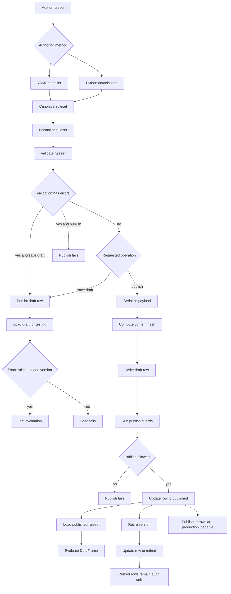
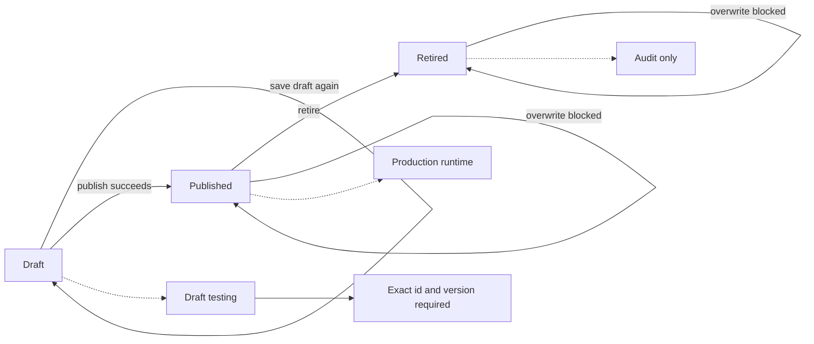
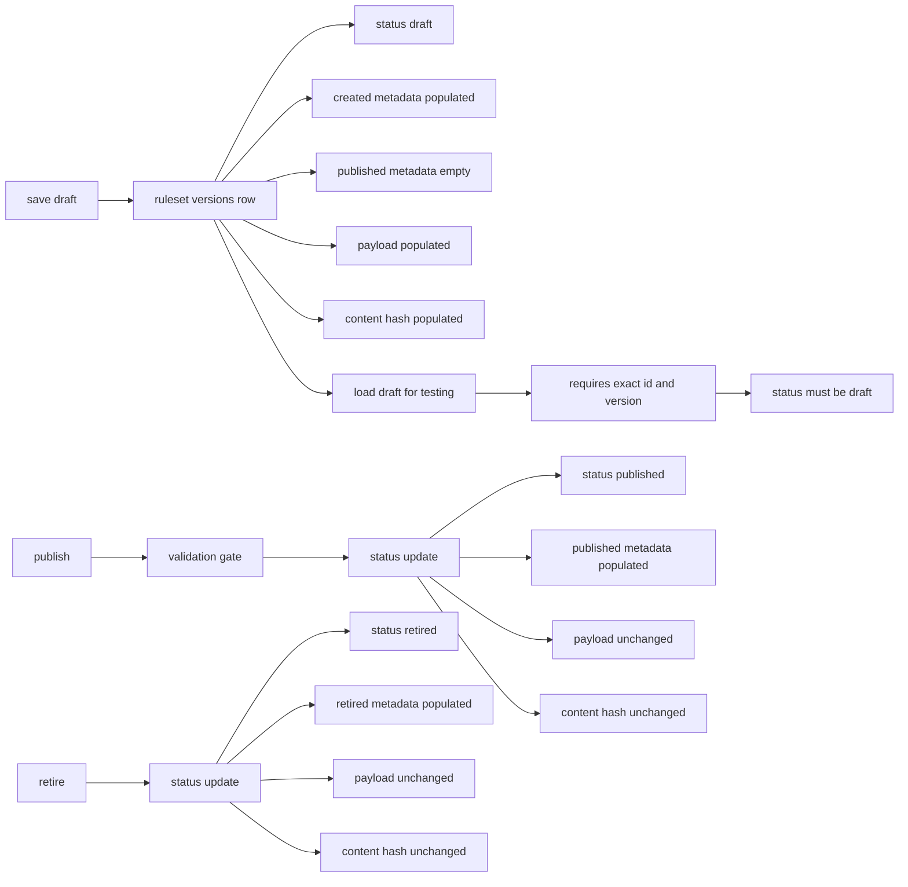

# Rules Engine

`rules_engine` is a strict, metadata-first Python rules engine designed for
Databricks workflows that require deterministic behavior, explicit metadata,
and audit-ready persistence.

The package compiles canonical YAML or code-authored dataclasses into immutable
ruleset models, validates them, normalizes them into publish-ready metadata,
persists them to Spark/Delta tables, and evaluates them against Python row
sets or Spark DataFrames.

The design intentionally avoids aliases, expression DSLs, raw persisted
lambdas, hidden runtime defaults, implicit aggregate behavior, and silent
semantic weakening.

## Contents

- [Who This Is For](#who-this-is-for)
- [Core Concepts](#core-concepts)
- [Package Layout](#package-layout)
- [Method Reference And Side Effects](#method-reference-and-side-effects)
- [Semantic Contract](#semantic-contract)
- [Authoring YAML](#authoring-yaml)
- [Compile, Validate, Normalize](#compile-validate-normalize)
- [YAML Export And Round Trip](#yaml-export-and-round-trip)
- [Custom Function Registry](#custom-function-registry)
- [Pure-Python Runtime](#pure-python-runtime)
- [Spark Runtime](#spark-runtime)
- [Spark Compatibility Validation](#spark-compatibility-validation)
- [Spark/Delta Repository](#sparkdelta-repository)
- [Publish Lifecycle](#publish-lifecycle)
- [Standard Workflows](#standard-workflows)
- [Auditability Model](#auditability-model)
- [Reconciliation CSV Translation Utility](#reconciliation-csv-translation-utility)
- [Databricks Smoke Test](#databricks-smoke-test)
- [Testing](#testing)
- [Packaging And Asset Bundles](#packaging-and-asset-bundles)
- [Developer Workflow](#developer-workflow)
- [Troubleshooting](#troubleshooting)
- [Known Limitations](#known-limitations)

## Who This Is For

This package is intended for engineers building governed rule execution
workflows where rules must be:

- authored in a readable external format,
- validated before execution,
- persisted as queryable metadata,
- executed deterministically,
- auditable after the fact,
- promoted through controlled lifecycle states.

The primary target runtime is Databricks Spark. The pure-Python evaluator exists
as a reference/test utility for small row sets and semantic parity checks.

## Core Concepts

### Ruleset

A `Ruleset` is the top-level metadata object. It has:

- `ruleset_id`
- `ruleset_name`
- `version`
- `status`
- `owner`
- `owner_department`
- optional `description`
- ordered `rules`

Lifecycle statuses are exactly:

```text
draft
published
retired
```

Runtime execution should use published metadata.

### Rule

A `Rule` contains:

- `rule_id`
- `rule_name`
- `rule_order`
- `root_group`
- `assignments`
- `active_flag`
- `stop_on_match`
- optional `description`

Rules are evaluated in `rule_order`. If a rule matches and `stop_on_match` is
`true`, later rules are not evaluated for that row.

### Condition Group

A condition group is a logical tree node with exactly one logical operator:

```text
all
any
```

Groups may contain conditions and nested groups. Empty groups are invalid.

### Condition

A condition compares a left operand to an optional right operand using a
canonical operator. Null behavior and tolerance are explicit metadata fields.

### Operand

Operands are one of:

```text
field
literal
aggregate
custom_function
```

No operand aliases are accepted.

### Assignment

Assignments are emitted when a rule matches. Assignment values may be literals,
fields, or custom functions. Aggregate assignments are forbidden in v1.

## Package Layout

```text
rules_engine/
  __init__.py
  compiler_yaml.py        # YAML -> dataclasses
  enums.py                # canonical vocabulary
  exceptions.py           # package exceptions
  exporter_yaml.py        # dataclasses -> canonical YAML
  models.py               # domain and persistence row dataclasses
  normalizer.py           # publish-ready explicit metadata
  publish.py              # lifecycle orchestration
  registry.py             # custom function registry
  repository.py           # Spark/Delta metadata repository
  runtime.py              # reference/test row evaluator used by Spark row UDF
  serializer.py           # dataclasses <-> persisted payload rows
  spark_runtime.py        # Spark DataFrame runtime
  spark_validator.py      # Spark compatibility validator
  validator.py            # semantic validator

databricks/
  smoke_test_rules_engine.py

notebooks/
  rules_engine_developer_guide.py
  rules_engine_quickstart.py
  python_ruleset_authoring_guide.py
  custom_function_authoring_guide.py
  production_yaml_publish_pipeline.py
  retire_ruleset_pipeline.py

rule_sets/
  account_key_cap_mkt.yaml
  account_key_mra.yaml

tools/
  recon_spec_translation/
    audit.py
    models.py
    normalizer.py
    reader_csv.py
    translator.py
    writer_yaml.py

tests/
```

## Method Reference And Side Effects

This section maps the major package methods to what they do, what they touch,
and what they intentionally do not do. Use this as the operational reference
while reading the developer notebook.

### `YamlRulesetCompiler.compile_text(yaml_text)`

Purpose:

- Parse a YAML string into the canonical `Ruleset` dataclass model.
- Reject malformed YAML and unsupported enum values.
- Preserve canonical vocabulary only.

Side effects:

- None. It does not write Delta metadata, validate semantic rules, or execute
  data.

Common failures:

- unquoted `null_result_mode: null`, which YAML parses as Python `None`.
  Use `null_result_mode: "null"`.
- unsupported aliases such as `value` instead of `literal`.
- unsupported aliases such as `assignments` instead of `assign`.

### `YamlRulesetCompiler.compile_path(path)`

Purpose:

- Read YAML text from disk and delegate to `compile_text()`.

Side effects:

- Reads one local/workspace file.
- Does not persist metadata or evaluate data.

### `RulesetValidator.validate(ruleset)`

Purpose:

- Validate the runtime-neutral semantic contract.
- Return a `ValidationResult` containing stable check names and human-readable
  messages.

Checks include:

- required IDs and rule attributes,
- duplicate rule and assignment IDs,
- empty condition groups,
- unary/binary operand compatibility,
- aggregate scope rules,
- quantile `q`,
- order-sensitive aggregate `order_by`,
- custom function registry contracts,
- nested aggregate prohibition.

Side effects:

- None. Validation does not mutate the ruleset and does not write metadata.

### `SparkRulesetCompatibilityValidator.validate(ruleset)`

Purpose:

- Run base semantic validation plus Spark runtime compatibility checks.
- Catch metadata that is valid in theory but unsupported by the current Spark
  execution path.

Additional Spark checks include:

- exact `median` and `quantile` unsupported,
- aggregate `null_input_mode=error` unsupported,
- aggregate `null_result_mode=error` unsupported,
- aggregate-filter error null modes unsupported,
- `first` / `last` with `null_input_mode=propagate` unsupported.

Side effects:

- None. This is a preflight gate.

### `RulesetNormalizer.normalize_ruleset(ruleset)`

Purpose:

- Materialize publish/runtime-ready explicit metadata.
- Ensure omitted tolerance is represented as `0`.
- Ensure aggregate payload defaults are explicit.

Side effects:

- None. It returns a normalized ruleset model.

### `YamlRulesetExporter.export_text(ruleset)`

Purpose:

- Convert a `Ruleset` dataclass back to canonical YAML.
- Preserve explicit IDs so compile-export-compile round trips are stable.

Side effects:

- None. It returns YAML text.

### `YamlRulesetExporter.export_path(ruleset, path)`

Purpose:

- Write canonical YAML to a file.

Side effects:

- Writes one file.
- Does not publish metadata and does not evaluate data.

### `PublishService.save_draft(ruleset, created_by=None)`

Purpose:

- Normalize, validate, and save draft metadata.
- Draft validation errors are returned to the caller but do not block saving.
  This preserves work-in-progress metadata while keeping `publish()` as the
  hard validation gate.

Detailed sequence:

1. Require `ruleset.status == draft`.
2. Normalize the ruleset.
3. Validate the normalized ruleset.
4. Return validation issues to the caller.
5. Save one `ruleset_versions` row with `status = draft`, even if validation
   has errors.
6. Replace an existing draft row for the same `(ruleset_id, version)`.

Delta tables affected:

- `ruleset_versions`

Side effects:

- Writes draft metadata.
- May write invalid draft metadata. Invalid drafts remain unpublishable until
  corrected.
- Does not make the ruleset loadable by `load_published()` unless it is later
  published.
- Does not evaluate business data.

Actor behavior:

- `created_by` is optional.
- If omitted, metadata uses `system`.

### `PublishService.publish(ruleset, created_by=None, published_by=None)`

Purpose:

- Validate and promote a draft ruleset version to published metadata.

Detailed sequence:

1. Require `ruleset.status == draft`.
2. Normalize the ruleset again.
3. Validate the normalized ruleset again as a publish-time gate.
4. Stop if validation has errors.
5. Save the normalized ruleset as draft metadata.
6. Verify the persisted target version exists and is still draft.
7. Verify another version of the same `ruleset_name` is not already published.
8. Update the `ruleset_versions` row to `status = published`.
9. Stamp `published_by` and `published_at`.

Delta tables affected:

- writes/replaces one draft row in `ruleset_versions`,
- updates that same row to `published`.

Side effects:

- Makes the ruleset loadable through `load_published()`.
- Does not evaluate input data.
- Does not overwrite already-published versions.

Actor behavior:

- `created_by` and `published_by` are optional.
- If omitted, metadata uses `system`.

### `SparkDeltaRulesetRepository.create_base_tables(mode)`

Purpose:

- Create empty Spark/Delta metadata tables with explicit schemas.

Side effects:

- Creates or overwrites Delta tables depending on `mode`.
- Defaults to `mode="error"`, which fails if a target table already exists.
- Use `mode="overwrite"` only for non-production setup or controlled smoke
  tests.

### `SparkDeltaRulesetRepository.load_published(ruleset_name, version=None)`

Purpose:

- Load published metadata from Delta and reconstruct a canonical `Ruleset`.

Detailed sequence:

1. Query `ruleset_versions` for `ruleset_name`, optional `version`, and
   `status = published`.
2. Read the canonical JSON payload from the matching row.
3. Compile the payload back into canonical dataclasses.

Side effects:

- Reads Delta metadata tables.
- Does not write metadata.
- Does not evaluate business data.

### `SparkDeltaRulesetRepository.load_draft_for_testing(ruleset_id, version)`

Purpose:

- Load draft metadata from Delta by exact identity for non-production testing.

Detailed sequence:

1. Query `ruleset_versions` for exact `ruleset_id` and `version`.
2. Require the persisted row to have `status = draft`.
3. Read the canonical JSON payload from the matching row.
4. Compile the payload back into canonical dataclasses.

Side effects:

- Reads Delta metadata tables.
- Does not write metadata.
- Does not evaluate business data.
- Does not load `published` or `retired` metadata.
- Does not resolve by `ruleset_name`, choose a latest draft, or fall back to
  published metadata.

### `SparkDeltaRulesetRepository.retire(ruleset_id, version, retired_by=None)`

Purpose:

- Mark a ruleset version as retired.

Side effects:

- Updates `ruleset_versions.status` to `retired`.
- Stamps `retired_by` and `retired_at`.
- Does not delete metadata.
- Makes that version unavailable through `load_published()`.

### `RulesEngineRuntime.evaluate(rows, ruleset)`

Purpose:

- Evaluate a ruleset against an iterable of Python dictionaries.

Side effects:

- None. It returns output rows and traces.
- Does not write metadata or mutate input rows.

Best use:

- local unit tests,
- small fixtures,
- semantic parity checks.

### `SparkRulesEngineRuntime.evaluate_dataframe(df, ruleset, fail_on_error=True)`

Purpose:

- Evaluate a Spark DataFrame against a ruleset.

Detailed sequence:

1. Discover aggregate operands.
2. Precompute group and dataset aggregates with Spark operations.
3. Join aggregate values back to original rows.
4. Use a Python UDF to evaluate final rule and assignment logic per row.
5. Append `rules_engine_*` result columns.
6. If `fail_on_error=True`, raise if any row has `rules_engine_error`.

Returned columns:

- `rules_engine_matched`
- `rules_engine_matched_rule_ids`
- `rules_engine_assign`
- `rules_engine_rule_results`
- `rules_engine_error`

Side effects:

- Returns a transformed DataFrame.
- Does not write output rows unless the caller writes the returned DataFrame.
- Does not mutate input metadata.

### `ReconciliationSpecTranslator.translate(rows, ...)`

Purpose:

- Convert source reconciliation CSV rows into canonical YAML payloads.

Detailed sequence:

1. Group rows by `MatchRuleName`.
2. Sort by `GroupSequence` and `CriteriaSequence`.
3. Fold `JoinType` left-to-right inside each group.
4. Fold `GroupJoinOperator` left-to-right across groups.
5. Map supported source operators to canonical rules engine operators.
6. Emit assignments to the configured target field.
7. Emit `stop_on_match: true` by default.
8. Emit required top-level `owner` and `owner_department` metadata from the
   explicit `translate(...)` arguments.
9. Produce translation audit records.

Side effects:

- None. It returns a payload and audit records.
- It does not publish metadata.
- It does not participate in runtime execution.

Intended workflow:

- translate to YAML,
- inspect audit,
- manually refine YAML,
- compile/validate/publish the refined artifact.

## Semantic Contract

The following rules are intentional and must not be relaxed without a design
review.

- Canonical vocabulary only. No aliases.
- YAML authoring is supported.
- Code-based authoring is supported through dataclasses.
- Published metadata must be fully resolved and explicit.
- Delta metadata is shaped for queryability.
- Runtime reads published metadata.
- Aggregate conditions are first-class operands.
- Aggregate scope is required and explicit.
- Aggregate scopes are exactly `group` and `dataset`.
- `scope=group` requires non-empty `by`.
- `scope=dataset` forbids `by`.
- Aggregates operate on the incoming row set exactly as provided.
- There is no implicit deduplication, reshaping, filtering, ordering, or
  cross-run state.
- Filtered aggregates are supported.
- Nested aggregates are forbidden.
- Collection-returning aggregates are not supported.
- Window/analytic aggregates are not part of v1.
- Null handling is explicit per condition and aggregate.
- Tolerance is absolute only.
- Omitted tolerance is normalized and persisted as `0`.
- Custom logic is allowed only through `FunctionRegistry`.
- Raw Python lambda persistence is not supported.
- Pre-publish and publish-time validation are mandatory.

## Supported Operators

Comparison operators:

```text
eq
ne
gt
ge
lt
le
in
not_in
between
not_between
like
not_like
contains
not_contains
starts_with
ends_with
is_null
is_not_null
```

String operators use canonical underscore-form values:

```text
contains
not_contains
starts_with
ends_with
```

`like` and `not_like` use SQL wildcard semantics in both the Python and Spark
runtimes.

Unary operators:

```text
is_null
is_not_null
```

Unary operators must not define a right operand. All other operators require a
right operand.

## Supported Aggregates

Aggregate functions:

```text
sum
mean
min
max
count
count_distinct
quantile
median
stddev
variance
first
last
```

Important aggregate rules:

- `quantile` requires `args.q` within `[0, 1]`.
- `first` and `last` require explicit `order_by`.
- `scope=group` requires `by`.
- `scope=dataset` forbids `by`.
- Aggregate filters may contain only row-level predicates.
- Nested aggregates are invalid.
- Aggregate assignments are invalid.
- Spark currently fails fast for `median` and `quantile` because Spark's
  available approximation functions do not match the exact Python semantics.

## Authoring YAML

### Minimal Row Rule

```yaml
ruleset_id: account_rules
ruleset_name: Account Rules
version: "1"
status: draft
owner: Rules Team
owner_department: ALM Engineering
rules:
  - rule_id: trad_account
    rule_name: TRAD Account
    rule_order: 1
    active_flag: true
    stop_on_match: false
    when:
      all:
        - left: { field: account_type }
          operator: eq
          right: { literal: TRAD, value_type: string }
          tolerance_abs: "0"
          null_input_mode: propagate
          null_result_mode: "null"
    assign:
      review_bucket: trad
```

### Group Aggregate Rule

```yaml
ruleset_id: account_rules
ruleset_name: Account Rules
version: "1"
status: draft
owner: Rules Team
owner_department: ALM Engineering
rules:
  - rule_id: high_value_account
    rule_name: High Value Account
    rule_order: 1
    when:
      all:
        - left:
            aggregate:
              function: sum
              field: amount
              scope: group
              by: [account_id]
              args: {}
              order_by: []
              null_input_mode: ignore
              null_result_mode: "null"
          operator: gt
          right: { literal: 1000000, value_type: number }
          tolerance_abs: "0"
          null_input_mode: propagate
          null_result_mode: "null"
    assign:
      review_bucket: high_value
```

### Filtered Aggregate Rule

```yaml
left:
  aggregate:
    function: sum
    field: amount
    scope: dataset
    args: {}
    order_by: []
    filter:
      all:
        - left: { field: status }
          operator: eq
          right: { literal: OPEN, value_type: string }
          tolerance_abs: "0"
          null_input_mode: propagate
          null_result_mode: "null"
    null_input_mode: ignore
    null_result_mode: "null"
operator: gt
right: { literal: 0, value_type: number }
tolerance_abs: "0"
null_input_mode: propagate
null_result_mode: "null"
```

### Custom Function Operand

```yaml
left:
  custom_function:
    name: score
    args:
      x: 2
      y: 3
operator: eq
right: { literal: 5, value_type: number }
tolerance_abs: "0"
null_input_mode: propagate
null_result_mode: "null"
```

## Compile, Validate, Normalize

Use `YamlRulesetCompiler` to compile YAML into dataclasses.

```python
from rules_engine import YamlRulesetCompiler, RulesetValidator

compiler = YamlRulesetCompiler()
ruleset = compiler.compile_path("rules.yaml")

validation = RulesetValidator().validate(ruleset)
if validation.has_errors():
    raise ValueError(validation.to_text())
```

Use `RulesetNormalizer` to materialize runtime/persistence-ready defaults.

```python
from rules_engine import RulesetNormalizer

normalized = RulesetNormalizer().normalize_ruleset(ruleset)
```

Normalization makes implicit authoring omissions explicit, including
`tolerance_abs = 0`, aggregate `args`, `by`, and `order_by` payloads.

## YAML Export And Round Trip

Rulesets can be exported back to canonical YAML for review, source control, or
governance workflows.

```python
from rules_engine import YamlRulesetCompiler, YamlRulesetExporter

ruleset = YamlRulesetCompiler().compile_path("rules.yaml")
yaml_text = YamlRulesetExporter().export_text(ruleset)
YamlRulesetExporter().export_path(ruleset, "rules_exported.yaml")
```

The exporter writes explicit rule, condition-group, condition, and assignment
identifiers so exported YAML can compile back into the same canonical
dataclasses.

## Custom Function Registry

Custom functions are executable code referenced by metadata. The repository
can persist the function specification, but it does not persist executable
Python callables.

For a notebook-style user guide, see:

```text
notebooks/custom_function_authoring_guide.py
```

```python
from rules_engine import CustomFunctionSpec, FunctionRegistry

registry = FunctionRegistry()
registry.register(
    CustomFunctionSpec(
        function_name="score",
        implementation_reference="my_package.scoring.score",
        arg_names=("x", "y"),
        allowed_in_condition_flag=True,
        allowed_in_assignment_flag=False,
        active_flag=True,
    ),
    implementation=lambda **kwargs: kwargs["x"] + kwargs["y"],
)
```

Validation checks:

- referenced function exists,
- function is active,
- function is allowed in condition or assignment context,
- supplied argument names exactly match the registered contract.

## Pure-Python Runtime

Use `RulesEngineRuntime` for iterable row sets.

```python
from rules_engine import FunctionRegistry, RulesEngineRuntime

runtime = RulesEngineRuntime(repository, FunctionRegistry())
output_rows, traces = runtime.evaluate(
    [
        {"account_type": "TRAD", "account_id": "A", "amount": 10},
        {"account_type": "AFS", "account_id": "B", "amount": 20},
    ],
    ruleset,
)
```

Output rows have this shape:

```python
{
    "row": {...},
    "matched": True,
    "matched_rule_ids": ["high_value_account"],
    "assign": {"review_bucket": "high_value"},
    "rule_results": [{"rule_id": "high_value_account", "matched": True}],
}
```

The Python runtime is useful for:

- unit tests,
- local semantic validation,
- cross-runtime parity checks,
- small metadata examples.

## Spark Runtime

Use `SparkRulesEngineRuntime` for Databricks Spark DataFrames.

```python
from rules_engine import FunctionRegistry, SparkRulesEngineRuntime

spark_runtime = SparkRulesEngineRuntime(repository, FunctionRegistry())
result_df = spark_runtime.evaluate_dataframe(
    input_df,
    ruleset,
    fail_on_error=True,
)
```

The Spark runtime appends:

```text
rules_engine_matched
rules_engine_matched_rule_ids
rules_engine_assign
rules_engine_rule_results
rules_engine_error
```

`rules_engine_assign` and `rules_engine_rule_results` are JSON strings.

Spark evaluation strategy:

1. Discover aggregate operands in the ruleset.
2. Precompute dataset and group aggregates with Spark DataFrame operations.
3. Join aggregate values back to the original input DataFrame.
4. Evaluate final rule logic in a Python UDF using row semantics aligned with
   the pure-Python runtime.
5. Fail fast if any row-level evaluator error is produced and `fail_on_error`
   is true.

The default is `fail_on_error=True`. This prevents row-level evaluator
exceptions from silently becoming false non-matches.

## Spark Compatibility Validation

Use `SparkRulesetCompatibilityValidator` before Databricks execution.

```python
from rules_engine import SparkRulesetCompatibilityValidator

spark_validation = SparkRulesetCompatibilityValidator(registry).validate(ruleset)
if spark_validation.has_errors():
    raise ValueError(spark_validation.to_text())
```

The Spark compatibility validator adds runtime-specific checks for metadata
that is valid in the abstract but unsupported by the current Spark execution
path:

- exact `median`,
- exact `quantile`,
- aggregate `null_input_mode=error`,
- aggregate `null_result_mode=error`,
- aggregate-filter `null_input_mode=error`,
- aggregate-filter `null_result_mode=error`,
- ordered `first` / `last` with aggregate `null_input_mode=propagate`.

These are errors by design. The runtime should not approximate or silently
weaken explicit authoring semantics.

## Spark/Delta Repository

`SparkDeltaRulesetRepository` writes metadata using explicit Spark schemas.

```python
from rules_engine.repository import SparkDeltaRulesetRepository, RulesEngineTableNames

tables = RulesEngineTableNames.from_schema("catalog.schema")

repository = SparkDeltaRulesetRepository(spark, tables)
repository.create_base_tables(mode="error")
```

Published metadata is stored in:

- `ruleset_versions`: one authoritative row per ruleset version.
- `function_registry`: environment-level custom function metadata.
- `ruleset_validation_logs`: one validation/publish log row per pipeline run.

`ruleset_versions` stores the complete canonical ruleset payload as JSON
alongside lifecycle status, provenance, content hash, and summary counts.
Runtime loading reads one published row and reconstructs the canonical
dataclasses from that payload. This avoids multi-table tree reconstruction and
keeps publication easier to audit.

## Publish Lifecycle

Publishing is coordinated through `PublishService`.

```python
from rules_engine import (
    PublishService,
    RulesetNormalizer,
    SparkRulesetCompatibilityValidator,
)

publish_service = PublishService(
    repository=repository,
    validator=SparkRulesetCompatibilityValidator(registry),
    normalizer=RulesetNormalizer(),
)

validation = publish_service.save_draft(ruleset)
if validation.has_errors():
    raise ValueError(validation.to_text())

publish_service.publish(ruleset)
```

Lifecycle rules:

- `save_draft` requires `ruleset.status == draft`.
- `save_draft` saves draft metadata even when validation returns errors.
- callers must inspect the returned `ValidationResult`.
- `publish` requires `ruleset.status == draft`.
- publish validates before status change.
- published rows are immutable by `(ruleset_id, version)`.
- `save_draft` cannot overwrite published or retired metadata.
- only one version of a given `ruleset_name` may be published at a time.
- `retire` changes a persisted ruleset version to `retired`.
- `load_published` loads only `published` metadata.
- `load_draft_for_testing` loads only exact `(ruleset_id, version)` draft metadata.
- production jobs should use published-only table/view access and `load_published`.

What `save_draft(ruleset)` does:

1. Normalizes the ruleset so publish/runtime metadata is explicit.
2. Validates the normalized ruleset.
3. Returns the validation result to the caller.
4. Persists one `ruleset_versions` row with `status = draft`, even when the
   validation result contains errors.
5. Replaces a prior draft row for the same `(ruleset_id, version)`.

Saving an invalid draft is allowed so authors can checkpoint incomplete work.
Publishing is the hard gate: `publish(ruleset)` fails before status change if
the configured validator reports any errors.

What `load_draft_for_testing(ruleset_id, version)` does:

1. Looks up exactly one persisted ruleset version by `ruleset_id` and `version`.
2. Requires the persisted row to have `status = draft`.
3. Reconstructs the canonical `Ruleset` from the persisted payload.
4. Fails for missing, `published`, or `retired` rows.

Draft testing loads do not resolve by `ruleset_name`, do not choose the latest
draft, and do not fall back to published metadata. Keep production callers on
`load_published(...)`; for additional environment protection, bind production
jobs to a published-only view over `ruleset_versions`.

What `publish(ruleset)` does:

1. Normalizes the ruleset again.
2. Validates the normalized ruleset again as a publish-time gate.
3. Fails before publishing if validation has errors.
4. Saves the normalized ruleset as draft metadata.
5. Verifies the target version exists and is still `draft`.
6. Verifies no other version of the same `ruleset_name` is published.
7. Updates the same `ruleset_versions` row to `status = published`.
8. Stamps `published_by` and `published_at`.

The double validation is deliberate. A previous draft save is not treated as
proof that the ruleset object being published is unchanged.

Tables affected by draft/publish:

- `ruleset_versions`: authoritative lifecycle/provenance/payload row.
- `function_registry`: unaffected by draft/publish unless registry metadata is
  saved separately.
- `ruleset_validation_logs`: validation/publish audit rows written by pipeline
  jobs.

Publishing metadata does not evaluate business data. It answers: "Is this
ruleset valid, persisted, auditable, and available to runtime?" Spark DataFrame
evaluation happens separately through `SparkRulesEngineRuntime`.

## Standard Workflows

### Initial Metadata Setup

Create the standard registry footprint once per target schema:

```python
from rules_engine.repository import RulesEngineTableNames, SparkDeltaRulesetRepository

schema = "catalog.schema"
table_names = RulesEngineTableNames.from_schema(schema)
repository = SparkDeltaRulesetRepository(spark, table_names)

spark.sql(f"CREATE SCHEMA IF NOT EXISTS {schema}")
repository.create_base_tables(mode="error")
```

This creates:

- `catalog.schema.ruleset_versions`
- `catalog.schema.function_registry`
- `catalog.schema.ruleset_validation_logs`

Use `mode="overwrite"` only for disposable development or smoke-test schemas.

### Non-Production Draft Testing

Authoring and test environments can persist drafts for repeatable testing:

```python
validation = publish_service.save_draft(ruleset, created_by="author")
if validation.has_errors():
    raise ValueError(validation.to_text())

draft = repository.load_draft_for_testing(
    ruleset_id=ruleset.ruleset_id,
    version=ruleset.version,
)
```

Draft loads require exact `(ruleset_id, version)`. They do not resolve latest
drafts and do not fall back to published metadata.

### Production YAML Publish Pipeline

The production pipeline is implemented in:

```text
notebooks/production_yaml_publish_pipeline.py
```

The pipeline expects a trusted YAML artifact in a production-controlled path.
The YAML should keep `status: draft`; publication is represented by the
registry row lifecycle state.

Required job parameters:

- `schema`: target catalog/schema, for example `alme_dev_bronze.rules_engine`.
- `yaml_path`: source YAML path.
- `archive_dir`: archive destination for source and canonical YAML copies.
- `created_by`: actor stored on draft persistence.
- `published_by`: actor stored on publication and automatic retirement.

Optional job parameters:

- `create_metadata_tables`: create the three registry tables when `true`.
- `create_log_table`: create `ruleset_validation_logs` when `true`.
- `retire_existing_published`: retire the currently published version before
  publishing a newer version.
- `require_newer_version`: require numeric dot-notation version ordering during
  automatic retirement.

The pipeline sequence is:

1. Compile YAML.
2. Normalize ruleset metadata.
3. Validate with `SparkRulesetCompatibilityValidator`.
4. Optionally retire the existing published version for the same `ruleset_name`.
5. Publish the incoming ruleset.
6. Export canonical YAML and copy the source YAML to the archive path.
7. Append a row to `ruleset_validation_logs`.

### New Version Cutover

By default, publishing fails if another version of the same `ruleset_name` is
already published.

Set:

```text
retire_existing_published = true
require_newer_version = true
```

to make the pipeline retire the currently published version and publish the
incoming version in one run. Versions must use numeric dot notation:

```text
1 < 1.0.1 < 1.1.0 < 2.0.0 < 2.1.0
```

Tags and date-like versions such as `v1.0.0`, `pilot`, or `2024-Q4` are rejected
for automatic retirement. If `2.1.0` is published and `1.0.0` is dropped, the
pipeline fails and leaves `2.1.0` published.

### Validation And Publish Logs

`ruleset_validation_logs` is the standard pipeline log table. It records one row
per publish pipeline run.

Key fields:

- `operation`: `publish` for the production YAML publish pipeline.
- `status`: `published`, `validation_failed`, or `failed`.
- `reason`: human-readable reason such as `validation failed`,
  `pipeline failed`, or automatic retirement context.
- `ruleset_id`, `ruleset_name`, `version`, `content_hash`.
- `retired_ruleset_id`, `retired_version` when automatic cutover retires an
  existing version.
- `validation_issue_count` and `validation_issues_json`.
- `source_yaml_path`, `canonical_yaml_path`, and `original_yaml_archive_path`.

### Standalone Retirement

Use standalone retirement when a published ruleset should be removed from
runtime eligibility without replacing it:

```text
notebooks/retire_ruleset_pipeline.py
```

Required job parameters:

- `schema`: target catalog/schema, for example `alme_dev_bronze.rules_engine`.
- `ruleset_id`: ruleset identity to retire.
- `version`: version to retire.
- `retired_by`: actor stored on the lifecycle row.
- `reason`: required audit reason written to `ruleset_validation_logs`.

The notebook calls:

```python
repository.retire(
    ruleset_id="account_rules",
    version="1.0.0",
    retired_by="operator",
)
```

Retirement changes the persisted row to `status = retired`, stamps
`retired_by` and `retired_at`, and makes the version unavailable through
`load_published(...)`. It also writes a log row with `operation = retire`,
`status = retired`, and the supplied `reason`. Drafts normally do not need
retirement; they can be overwritten while they remain drafts.

### Lifecycle Flow

This diagram shows the full ruleset lifecycle from authoring through runtime
evaluation and retirement.

These Mermaid fences use GitHub Markdown syntax. The companion `README.qmd`
uses Quarto Mermaid cell syntax for Quarto HTML/PDF rendering.



### Lifecycle States



### Table State Transitions



Key lifecycle points:

- `payload_json` is the canonical persisted ruleset content.
- `content_hash` is SHA-256 of the persisted `payload_json` bytes.
- `payload_metadata` stores derived size/count metadata for queryability.
- `user_metadata.owner` and `user_metadata.owner_department` identify business
  ownership authored in YAML or Python.
- `user_metadata.created_by` and `user_metadata.created_at` identify the draft
  metadata write.
- `user_metadata.published_by` and `user_metadata.published_at` identify promotion to runtime-loadable
  metadata.
- `user_metadata.retired_by` and `user_metadata.retired_at` identify removal
  from runtime eligibility.
- Draft rows can exist in Delta, but runtime ignores them.
- Published rows are the only rows loaded by `load_published(...)`.
- Retired rows remain in Delta for audit but are not runtime-loadable.
- `publish(...)` can be called directly; it internally writes the draft row
  first, then promotes that row.

## Auditability Model

Ruleset metadata rows include:

```text
payload_metadata.rule_count
payload_metadata.condition_count
payload_metadata.assignment_count
payload_metadata.aggregate_count
payload_metadata.custom_function_count
user_metadata.owner
user_metadata.owner_department
user_metadata.created_by
user_metadata.created_at
user_metadata.published_by
user_metadata.published_at
user_metadata.retired_by
user_metadata.retired_at
content_hash
```

`owner` and `owner_department` are ruleset governance fields authored in YAML
or Python and persisted under `user_metadata`. `created_by` and `published_by`
are lifecycle actor fields. They are optional at API call time; when omitted,
persisted lifecycle actor metadata uses `system`, which is appropriate for
locked-down production jobs that run through a dedicated cluster or service
principal.

`content_hash` is a deterministic SHA-256 hash of the persisted
`payload_json` bytes. Lifecycle status and provenance are excluded from the
payload, so the hash represents rule content rather than who saved or
published it. An auditor can recompute it directly from the stored
`payload_json` column.

There is no runtime `validation_results` table. Publication is the validation
gate: if a ruleset version is `published`, it passed the configured validator
at publish time. Failed validations are returned to the caller and are not part
of runtime metadata.

The audit model supports these operational questions:

- Who created this metadata version?
- When was it saved?
- Who published it?
- When was it published?
- Did the content change between environments?
- What exact canonical YAML/JSON payload was published?

## Reconciliation CSV Translation Utility

The reconciliation translator is outside the runtime package. It is a
one-time migration utility that converts external reconciliation CSV specs
into canonical YAML authoring payloads.

It does not participate in runtime execution.
It is kept in the repository under `tools/`, but it is intentionally excluded
from the production wheel artifact. Run it from source or package it separately
for migration work.

The intended workflow is:

1. translate the source CSV into YAML,
2. write the translation audit artifact,
3. manually refine the YAML for rules or semantics not captured by the source
   reconciliation spec,
4. compile, validate, publish, and execute the refined YAML through the rules
   engine.

Source CSV columns:

```text
MatchRuleName
GroupSequence
GroupJoinOperator
CriteriaSequence
FieldName
ValueOperator
Value
JoinType
```

Supported source operators:

```text
TextEquals          -> eq
TextNotEquals       -> ne
TextContains        -> contains
TextNotContains     -> not_contains
TextInList          -> in
NumericLessThan     -> lt
NumericGreaterThan  -> gt
```

Example:

```python
from tools.recon_spec_translation.reader_csv import read_reconciliation_csv
from tools.recon_spec_translation.translator import ReconciliationSpecTranslator
from tools.recon_spec_translation.writer_yaml import write_yaml
from tools.recon_spec_translation.audit import write_audit

rows = read_reconciliation_csv("source_spec.csv")
result = ReconciliationSpecTranslator(
    assignment_target_field="translated_match_rule_name",
).translate(
    rows,
    owner="Rules Team",
    owner_department="ALM Engineering",
)

if any(record.failures for record in result.audit_records):
    write_audit(result.audit_records, "translation_audit.json")
    raise ValueError("Translation failed. Review translation_audit.json.")

write_yaml(result.payload, "translated_rules.yaml")
write_audit(result.audit_records, "translation_audit.json")
```

Join semantics:

- `JoinType` connects the current source row to the next source row.
- `GroupJoinOperator` connects the current source group to the next source
  group.
- `JoinType = null` terminates the current condition group and is only valid
  on the final condition row for that `GroupSequence`.
- `GroupJoinOperator = null` terminates the rule group chain and is only valid
  on the final `GroupSequence`.
- condition and group chains are folded left-to-right. For example,
  `A And B And C Or D` becomes `(((A And B) And C) Or D)`.
- translated rules default to `stop_on_match: true`, so the first matching
  rule by `rule_order` wins. Pass `stop_on_match=False` to
  `ReconciliationSpecTranslator` only when multi-match behavior is explicitly
  intended.
- malformed chains fail translation and are reported in the audit.

## Databricks Smoke Test

After copying or installing the package into Databricks, run:

```text
databricks/smoke_test_rules_engine.py
```

The smoke test:

1. Creates smoke-test Delta tables.
2. Compiles a small Spark-compatible ruleset.
3. Runs Spark compatibility validation.
4. Publishes the ruleset with explicit provenance.
5. Loads the published ruleset.
6. Evaluates a Spark DataFrame with `fail_on_error=True`.
7. Verifies expected matches.
8. Retires the ruleset.
9. Verifies the retired version is no longer loadable as published.

## Supplemental Notebook

The notebook source file is:

```text
notebooks/rules_engine_developer_guide.py
```

It is a Databricks-style Python notebook source file. Import it into
Databricks or copy cells into a Databricks notebook. It walks through:

- YAML authoring,
- compile/validate/normalize,
- YAML export,
- Python runtime execution,
- Spark compatibility validation,
- Delta repository setup,
- publish/load/retire workflow,
- Spark DataFrame evaluation,
- reconciliation CSV translation.

The quickstart notebook is:

```text
notebooks/rules_engine_quickstart.py
```

It provides the shortest Databricks workflow: compile YAML, validate for Spark,
create metadata tables, publish, load, and evaluate a Spark DataFrame.

The Python authoring notebook is:

```text
notebooks/python_ruleset_authoring_guide.py
```

It demonstrates code-based ruleset authoring with the public dataclass API,
validates the resulting model, exports canonical YAML with
`YamlRulesetExporter`, and evaluates a small fixture with the pure-Python
runtime. By default, it writes the generated example YAML to `rule_sets/`.

## Testing

Run the default local suite:

```powershell
& 'C:\Users\aarba\.conda\envs\GeneralEnv\python.exe' -m pytest -q tests -p no:cacheprovider --basetemp pytest-cache-files-local
```

Spark tests are skipped by default because local Spark startup can be
environment-sensitive. To run them:

```powershell
$env:RULES_ENGINE_RUN_SPARK_TESTS = "1"
& 'C:\Users\aarba\.conda\envs\GeneralEnv\python.exe' -m pytest -q tests
```

Run Spark tests in Databricks before relying on Spark execution in production.

## Packaging And Asset Bundles

The recommended production deployment pattern is wheel-based:

```text
source repo -> build wheel -> deploy Asset Bundle -> install wheel on job task -> run smoke test
```

This avoids production dependencies on workspace source folders and removes the
need for `sys.path.append(...)` in production jobs. Development notebooks may
still use `sys.path` while files are being copied manually, but production jobs
should import the installed package:

```python
from rules_engine import YamlRulesetCompiler, SparkRulesEngineRuntime
```

The repo includes:

```text
pyproject.toml
databricks.yml
resources/rules_engine_smoke_test.job.yml
databricks/smoke_test_rules_engine.py
```

The production wheel includes the `rules_engine` package only. Repository
utilities under `tools/` are intentionally excluded from the wheel because they
are migration/support tooling, not runtime dependencies.

Build the wheel locally:

```powershell
& 'C:\Users\aarba\.conda\envs\GeneralEnv\python.exe' -m pip install build
& 'C:\Users\aarba\.conda\envs\GeneralEnv\python.exe' -m build --wheel
```

Validate and deploy the bundle from the repo root after configuring Databricks
CLI authentication:

```powershell
databricks bundle validate --target dev --var "workspace_host=https://<workspace-host>" --var "existing_cluster_id=<cluster-id>"
databricks bundle deploy --target dev --var "workspace_host=https://<workspace-host>" --var "existing_cluster_id=<cluster-id>"
databricks bundle run rules_engine_smoke_test --target dev --var "workspace_host=https://<workspace-host>" --var "existing_cluster_id=<cluster-id>"
```

The smoke-test script creates/overwrites its own smoke-test Delta metadata
tables, publishes a small ruleset, evaluates a Spark DataFrame, verifies that
two rows match, retires the ruleset, and confirms retired metadata is no longer
loadable as published.

For Azure DevOps, keep the same sequence in the pipeline:

```text
install dependencies
run pytest
build wheel
databricks bundle validate
databricks bundle deploy
databricks bundle run rules_engine_smoke_test
```

Production deployment should use a service principal or your organization's
approved Databricks authentication pattern rather than a personal token.

## Developer Workflow

Recommended local workflow:

1. Edit YAML, dataclasses, or runtime code.
2. Run compile/validator tests.
3. Run serializer/exporter tests.
4. Run pure-Python runtime tests.
5. Run default test suite.
6. Run Spark tests in Databricks or Spark-enabled CI.
7. Run `databricks/smoke_test_rules_engine.py`.
8. Review generated Delta metadata rows.
9. Promote package artifact or source to the target environment.

Recommended Databricks workflow:

1. Install or copy the package.
2. Configure table names in the target catalog/schema.
3. Run the smoke test against non-production tables.
4. Publish a representative draft ruleset.
5. Load published metadata.
6. Evaluate a representative DataFrame.
7. Assert `rules_engine_error` is empty.
8. Validate output counts and assignments against expected results.
9. Retire test metadata.

## Logging

The package uses Python's standard `logging` library and does not configure
global logging handlers. Databricks jobs, notebooks, or deployment wrappers
should configure log level and destinations according to the environment.

Useful loggers:

- `rules_engine.publish`: draft save, validation result, publish start/failure/success.
- `rules_engine.repository`: Delta table creation, draft persistence, lifecycle status
  changes, published metadata loads, and function registry metadata writes.
- `rules_engine.runtime`: pure-Python/reference evaluation start/end and aggregate
  cache calculation at debug level.
- `rules_engine.spark_runtime`: Spark DataFrame evaluation start/end, aggregate
  precompute columns at debug level, and row-level error detection.

Example notebook/job setup:

```python
import logging

logging.basicConfig(
    level=logging.INFO,
    format="%(asctime)s %(levelname)s %(name)s - %(message)s",
)
```

The logging intentionally avoids input row payloads, YAML payload bodies, and
assignment values. It records identifiers, versions, counts, statuses, table
names, and content hashes so production job logs are useful without exposing
business-sensitive row data.

## Troubleshooting

### YAML Compile Fails

Common causes:

- unsupported key such as `value` instead of `literal`,
- unsupported key such as `assignments` instead of `assign`,
- unsupported aggregate key such as `field_name` instead of `field`,
- missing `null_input_mode`,
- missing `null_result_mode`,
- malformed condition group with more than one logical operator.

### Validation Fails

Use:

```python
print(validation.to_text())
```

Validation issues have stable `check_name` values for programmatic filtering.

### Spark Compatibility Fails

Use `SparkRulesetCompatibilityValidator` output. The current Spark runtime
intentionally rejects exact percentile aggregates and unsupported explicit
error null modes.

### Spark Evaluation Raises Row-Level Errors

This is expected when `fail_on_error=True`. Inspect the first surfaced error,
fix the ruleset or input schema, then rerun. Do not disable fail-fast behavior
for regulated production workflows unless downstream monitoring explicitly
handles `rules_engine_error`.

### Published Ruleset Cannot Be Loaded

Check:

- the ruleset was published, not only saved as draft,
- the name and version match,
- another version was not left published,
- the version was not retired.

### Save Draft Fails

`save_draft` cannot overwrite a published or retired version. Increment the
version or retire/publish through the intended lifecycle.

## Known Limitations

- v1 supports one published version per `ruleset_name`. Retire the currently
  published version before publishing a replacement version.
- v1 does not guarantee concurrent publish safety. Run publication from a
  controlled promotion workflow, not competing interactive jobs.
- `save_draft` uses a replace-style draft write. Use it for controlled
  authoring/checkpoint workflows; do not treat it as a concurrent production
  promotion transaction.
- Spark runtime uses a Python UDF for final rule evaluation.
- Spark runtime does not yet compile every row predicate into native Spark
  expressions.
- Spark aggregate precompute fails fast for explicit modes listed in
  [Spark Compatibility Validation](#spark-compatibility-validation).
- Spark `median` and `quantile` are not enabled until exact Spark semantics are
  implemented.
- `like` and `not_like` support SQL `%` and `_` wildcards. Escape-character
  semantics for literal `%` or `_` are not part of v1.
- Custom function implementations must be available to Spark workers and must
  be serializable by Spark's Python UDF machinery. Prefer named module-level
  functions over lambdas.
- The pure-Python evaluator is a reference/test utility. Production execution
  is Databricks Spark.
- Utilities under `tools/`, notebooks, and sample `rule_sets/` are not included
  in the production wheel.
- Runtime traces are compact rule/condition pass-fail structures, not full
  resolved-value audit records.
